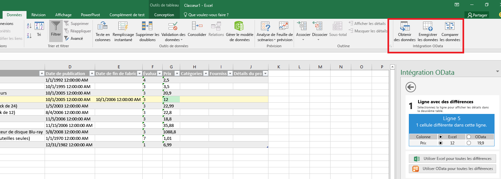
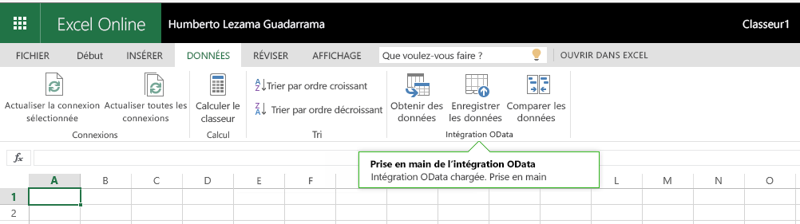

# Commandes de complément pour Excel, Word et PowerPoint

Les commandes de complément sont des éléments qui étendent l’interface utilisateur d’Office et qui lancent des actions dans votre complément. Vous pouvez ajouter un bouton sur le ruban ou un élément à un menu contextuel. Lorsque les utilisateurs sélectionnent une commande de complément, ils lancent des actions telles que l’exécution de code JavaScript ou l’affichage d’une page de complément dans un volet Office. Les commandes de complément permettent aux utilisateurs de trouver et d’utiliser votre complément, ce qui contribue à augmenter l’adoption et la réutilisation de votre complément, ainsi qu’à améliorer la fidélisation des clients.

Pour en savoir plus sur les fonctionnalités, regardez la vidéo sur les [commandes de complément du ruban Office](https://channel9.msdn.com/events/Build/2016/P551).

>**Remarque :** les catalogues SharePoint n’acceptent pas les commandes de complément. Vous pouvez déployer des commandes de complément via le [déploiement centralisé](https://support.office.com/en-ie/article/Deploy-Office-Add-ins-in-the-Office-365-new-Admin-Center-737e8c86-be63-44d7-bf02-492fa7cd9c3f?ui=en-US&rs=en-IE&ad=IE) ou l’[Office Store](https://msdn.microsoft.com/en-us/library/jj220033.aspx), ou utiliser le [chargement de version test](https://dev.office.com/docs/add-ins/testing/create-a-network-shared-folder-catalog-for-task-pane-and-content-add-ins) pour déployer votre commande de complément à des fins de test. 

**Complément incluant des commandes en cours d’exécution dans Excel (version Bureau)**

**Complément incluant des commandes en cours d’exécution dans Excel (version Online)**

## Fonctionnalités de commande
Les fonctionnalités de commande suivantes sont actuellement prises en charge.

> **Remarque :** les compléments de contenu ne prennent actuellement pas en charge les commandes de complément.

**Points d’extension**

- Onglets de ruban - Permet d’étendre les onglets prédéfinis ou de créer un onglet personnalisé.
- Menus contextuels - Permet d’étendre les menus contextuels sélectionnés. 

**Types de contrôles**

- Boutons simples - Permettent de déclencher des actions spécifiques.
- Menus - Menu déroulant simple avec des boutons qui déclenchent des actions.

**Actions**

- ShowTaskpane - Affiche un ou plusieurs volets où sont chargées des pages HTML personnalisées.
- ExecuteFunction - Charge une page HTML invisible, puis y exécute une fonction JavaScript. Pour afficher l’interface utilisateur au sein de votre fonction (par exemple, erreurs, avancement, entrées supplémentaires), vous pouvez utiliser l’API [displayDialog](http://dev.office.com/reference/add-ins/shared/officeui).  

## Plateformes prises en charge
Les commandes de complément sont actuellement prises en charge sur les plateformes suivantes :

- Office pour Windows 2016 pour ordinateur de bureau (version 16.0.6769.0000 ou ultérieure)
- Office Online avec comptes personnels
- Office Online avec comptes professionnels ou scolaires (aperçu)
- Office pour Mac ([aperçu](https://github.com/OfficeDev/Office-Add-in-Commands-Samples/blob/master/Tools/MacDevPreview.md))

D’autres plateformes seront bientôt disponibles.

## Prise en main des commandes de complément

La meilleure façon de commencer à employer les commandes de complément est par l’intermédiaire d’**exemples**. Consultez les [exemples de commandes de complément Office](https://github.com/OfficeDev/Office-Add-in-Commands-Samples/) sur GitHub.

Pour obtenir des informations de référence détaillées sur le manifeste, consultez la rubrique relative à la [définition de commandes de complément dans votre manifeste](http://dev.office.com/docs/add-ins/outlook/manifests/define-add-in-commands).

