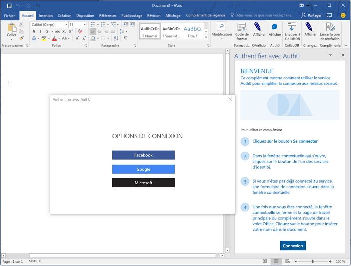
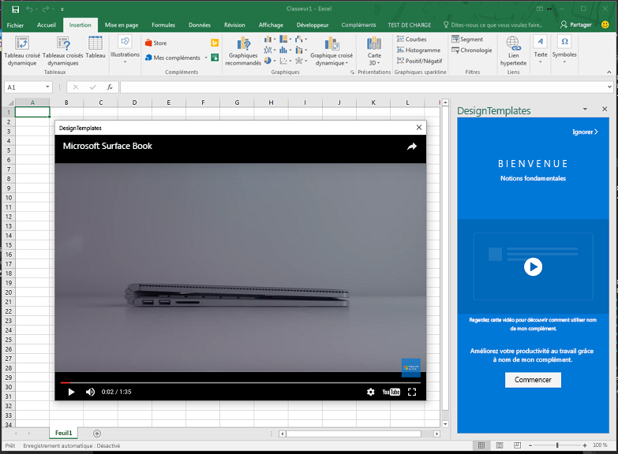

# <a name="use-the-dialog-api-in-your-office-add-ins"></a>Utiliser l’API de dialogue dans vos compléments Office 

Vous pouvez utiliser l’[API de dialogue](../../reference/shared/officeui.md) pour ouvrir des boîtes de dialogue dans votre complément Office. Cet article fournit des conseils concernant l’utilisation de l’API de dialogue dans votre complément Office.

> **Remarque :** pour plus d’informations sur les applications où l’API de dialogue est actuellement prise en charge, consultez la rubrique relative aux [ensembles de conditions requises de l’API de dialogue](../../reference/requirement-sets/dialog-api-requirement-sets.md). L’API de dialogue est actuellement prise en charge pour Word, Excel, PowerPoint et Outlook.

Vous souhaiterez peut-être ouvrir une boîte de dialogue à partir d’un volet Office, d’un complément de contenu ou d’un [complément de commande](https://dev.office.com/docs/add-ins/design/add-in-commands) pour : 

- afficher les pages de connexion qui ne peuvent pas être ouvertes directement dans un volet Office ;
- fournir davantage d’espace à l’écran, ou même un plein écran, pour certaines tâches exécutées dans votre complément ;
- héberger une vidéo qui serait trop petite si elle était limitée à un volet Office.

>**Remarque :** comme des éléments d’IU qui se chevauchent peuvent gêner des utilisateurs, évitez d’ouvrir une boîte de dialogue à partir d’un volet Office à moins que votre scénario l’exige. Lorsque vous envisagez d’utiliser la surface d’exposition d’un volet Office, tenez compte du fait que les volets Office peuvent être affichés sous forme d’onglets. Pour voir un exemple, consultez la rubrique relative à l’exemple [Complément Excel JavaScriptSalesTracker](https://github.com/OfficeDev/Excel-Add-in-JavaScript-SalesTracker).

L’image suivante montre un exemple de boîte de dialogue. 



Notez que la boîte de dialogue s’ouvre toujours au centre de l’écran. L’utilisateur peut la déplacer et la redimensionner. La fenêtre est *non modale* : un utilisateur peut continuer à interagir à la fois avec le document dans l’application Office hôte et avec la page hôte dans le volet Office, le cas échéant.

## <a name="dialog-api-scenarios"></a>Scénarios de l’API de dialogue

Les API JavaScript Office prennent en charge les scénarios suivants avec un objet [Dialog](../../reference/shared/officeui.dialog.md) et deux fonctions dans l’[espace de noms Office.context.ui](../../reference/shared/officeui.md). 

### <a name="opening-a-dialog-box"></a>Ouverture d’une boîte de dialogue

Pour ouvrir une boîte de dialogue, votre code dans le volet Office appelle la méthode [displayDialogAsync](../../reference/shared/officeui.displaydialogasync.md) et lui transmet l’URL de la page qui doit s’ouvrir. Voici un exemple simple.

```js
Office.context.ui.displayDialogAsync('https://myAddinDomain/myDialog.html'); 
```

> **Remarques :**

> - L’URL utilise le protocole HTTP**S**. Ceci est obligatoire pour toutes les pages chargées dans une boîte de dialogue, pas seulement la première page chargée.
> - Le domaine est le même que celui de la page hôte, qui peut être la page d’un volet Office ou le [fichier de fonctions](https://dev.office.com/reference/add-ins/manifest/functionfile) d’une commande de complément. Ceci n’est pas obligatoire pour la première page chargée dans la boîte de dialogue, mais si la première page n’est pas dans le même domaine que votre complément, vous devez répertorier ce domaine dans l’élément [`<AppDomains>`](../../reference/manifest/appdomains.md) du manifeste de votre complément.

Une fois que la première page est chargée, un utilisateur peut accéder à n’importe quel site web utilisant le protocole HTTPS. Vous pouvez également concevoir la première page de façon à ce que l’utilisateur soit immédiatement redirigé vers un autre site. 

Par défaut, la boîte de dialogue occupera 80 % de la hauteur et de la largeur de l’écran de l’appareil, mais vous pouvez définir des pourcentages différents en transmettant un objet de configuration à la méthode, comme indiqué dans l’exemple suivant.

```js
Office.context.ui.displayDialogAsync('https://myDomain/myDialog.html', {height: 30, width: 20}); 
```

Pour voir un exemple de complément qui effectue ce type d’action, consultez la rubrique relative à l’[exemple d’API de dialogue de complément Office](https://github.com/OfficeDev/Office-Add-in-Dialog-API-Simple-Example).

Définissez les deux valeurs sur 100 % pour bénéficier d’une réelle d’expérience de plein écran. (Le maximum réel est de 99,5 %, et la fenêtre peut toujours être déplacée et redimensionnée.)

>**Remarque :** une seule boîte de dialogue peut être ouverte à partir d’une fenêtre hôte. Toute tentative d’ouverture d’une autre boîte de dialogue génère une erreur. (Pour plus d’informations, consultez la rubrique relative aux [erreurs de displayDialogAsync](#errors-from-displaydialogAsync).) Ainsi, par exemple, si un utilisateur ouvre une boîte de dialogue à partir d’un volet Office, il ne peut pas ouvrir une seconde boîte de dialogue à partir d’une autre page dans le volet Office. Toutefois, quand une boîte de dialogue est ouverte à partir d’une [commande de complément](https://dev.office.com/docs/add-ins/design/add-in-commands), la commande ouvre un nouveau fichier HTML (mais invisible) chaque fois qu’elle est sélectionnée. Cela crée une nouvelle fenêtre hôte (invisible), afin que chaque fenêtre de ce type puisse lancer sa propre boîte de dialogue. 

### <a name="sending-information-from-the-dialog-box-to-the-host-page"></a>Envoi d’informations à partir de la boîte de dialogue à la page hôte

La boîte de dialogue ne peut pas communiquer avec la page hôte dans le volet Office, sauf si :

- la page active dans la boîte de dialogue se trouve dans le même domaine que la page hôte ;
- la bibliothèque JavaScript Office est chargée dans la page. (Comme n’importe quelle page qui utilise la bibliothèque JavaScript Office, le script de la page doit attribuer une méthode à la propriété `Office.initialize`, bien qu’il puisse s’agir d’une méthode vide. Pour plus d’informations, voir [Initialisation de votre complément](http://dev.office.com/docs/add-ins/develop/understanding-the-javascript-api-for-office#initializing-your-add-in).) 

Le code de la page de boîte de dialogue utilise la fonction `messageParent` pour envoyer une valeur booléenne ou un message de type chaîne à la page hôte. La chaîne peut être un mot, une phrase, un blob XML, un JSON converti en chaîne ou un autre élément pouvant être sérialisé en chaîne. Voici un exemple.

```js
if (loginSuccess) {
    Office.context.ui.messageParent(true); 
}
```

>**Remarques :** 

> - La fonction `messageParent` est l’une des deux *seules* API Office pouvant être appelées dans la boîte de dialogue. (L’autre est `Office.context.requirements.isSetSupported`. Pour plus d’informations, consultez la rubrique relative à la [spécification d’hôtes Office et de conditions requises d’API](https://github.com/OfficeDev/office-js-docs/blob/master/docs/overview/specify-office-hosts-and-api-requirements.md).
> - La fonction `messageParent` peut uniquement être appelée sur une page ayant le même domaine (y compris les mêmes protocole et port) que la page hôte.

Dans l’exemple suivant, `googleProfile` est une version convertie en chaîne du profil Google de l’utilisateur.

```js
if (loginSuccess) {
    Office.context.ui.messageParent(googleProfile); 
}
```

La page hôte doit être configurée de façon à recevoir le message. Pour ce faire, ajoutez un paramètre de rappel à l’appel d’origine de `displayDialogAsync`. Le rappel attribue un gestionnaire à l’événement `DialogMessageReceived`. Voici un exemple. Tenez compte des informations suivantes :

- Office transmet un objet [AsyncResult](https://dev.office.com/reference/add-ins/shared/asyncresult) au rappel. Il représente le résultat de la tentative d’ouverture de la boîte de dialogue. Il ne représente pas le résultat de tous les événements dans la boîte de dialogue. Pour plus d’informations sur cette distinction, consultez la section [Erreurs et événements de gestion](#handling-errors-and-events). 
- La propriété `value` de `asyncResult` est définie sur un objet [Dialog](https://dev.office.com/reference/add-ins/shared/officeui.dialog), qui existe dans la page hôte, pas dans le contexte d’exécution de la boîte de dialogue.
- `processMessage` est la fonction qui gère l’événement. Vous pouvez lui donner le nom que vous souhaitez. 
- La variable `dialog` est déclarée avec une portée plus large que le rappel, car elle est également référencée dans `processMessage`.

```js
var dialog;
Office.context.ui.displayDialogAsync('https://myDomain/myDialog.html', {height: 30, width: 20},
    function (asyncResult) {
        dialog = asyncResult.value;
        dialog.addEventHandler(Office.EventType.DialogMessageReceived, processMessage);
    }
); 
```

Voici un exemple simple de gestionnaire pour l’événement `DialogMessageReceived`. Tenez compte des informations suivantes :

- Office transmet l’objet `arg` au gestionnaire. Sa propriété `message` est la valeur booléenne ou la chaîne envoyée par l’appel de `messageParent` dans la boîte de dialogue. Dans cet exemple, il s’agit d’une représentation convertie en chaîne du profil de l’utilisateur à partir d’un service tel qu’un compte Microsoft ou Google, qui est donc désérialisé en objet avec `JSON.parse`.
- L’implémentation `showUserName` n’est pas visible. Elle peut afficher un message de bienvenue personnalisé dans le volet Office.

```js
function processMessage(arg) {
    var messageFromDialog = JSON.parse(arg.message);
    showUserName(messageFromDialog.name);
}
```

Lorsque l’intervention de l’utilisateur sur la boîte de dialogue est terminée, votre gestionnaire de messages doit fermer la boîte de dialogue, comme indiqué dans cet exemple. Tenez compte des informations suivantes :

- L’objet `dialog` doit être le même que celui renvoyé par l’appel de `displayDialogAsync`. 
- L’appel de `dialog.close` indique à Office de fermer immédiatement la boîte de dialogue.

```js
function processMessage(arg) {
    dialog.close();
    // message processing code goes here;
}
```

Pour voir un exemple de complément qui utilise ces techniques, consultez la rubrique relative à l’[exemple d’API de dialogue de complément Office](https://github.com/OfficeDev/Office-Add-in-Dialog-API-Simple-Example).

Si le complément a besoin d’ouvrir une autre page du volet Office après avoir reçu le message, vous pouvez utiliser la méthode `window.location.replace` (ou `window.location.href`) en tant que dernière ligne du gestionnaire. Voici un exemple.

```js
function processMessage(arg) {
    // message processing code goes here;
    window.location.replace("/newPage.html");
    // Alternatively ...
    // window.location.href = "/newPage.html";
}
```

Pour voir un exemple de complément qui effectue ce type d’action, consultez la rubrique relative à l’exemple [Insérer des graphiques Excel à l’aide de Microsoft Graph dans un complément PowerPoint](https://github.com/OfficeDev/PowerPoint-Add-in-Microsoft-Graph-ASPNET-InsertChart). 

#### <a name="conditional-messaging"></a>Messagerie conditionnelle

Étant donné que vous pouvez envoyer plusieurs appels `messageParent` à partir de la boîte de dialogue, mais que vous n'avez qu’un seul gestionnaire dans la page hôte pour l’événement `DialogMessageReceived`, le gestionnaire doit utiliser la logique conditionnelle pour distinguer les différents messages. Par exemple, si la boîte de dialogue invite un utilisateur à se connecter à un fournisseur d’identité tel qu’un compte Microsoft ou Google, elle envoie le profil de l’utilisateur sous la forme d’un message. Si l’authentification échoue, la boîte de dialogue doit envoyer des informations sur l’erreur à la page hôte, comme dans l’exemple suivant. Tenez compte des informations suivantes :

- La variable `loginSuccess` serait initialisée en lisant la réponse HTTP à partir du fournisseur d’identité.
- L’implémentation des fonctions `getProfile` et `getError` n’est pas affichée. Chacune obtient des données à partir d’un paramètre de requête ou du corps de la réponse HTTP.
- Des objets anonymes de différents types sont envoyés selon que la connexion a réussi ou non. Tous deux ont une propriété `messageType`, mais un a une propriété `profile` et l’autre une propriété `error`.

```js
if (loginSuccess) {
    var userProfile = getProfile();
    var messageObject = {messageType: "signinSuccess", profile: userProfile};            
    var jsonMessage = JSON.stringify(messageObject);
    Office.context.ui.messageParent(jsonMessage); 
} else {
    var errorDetails = getError();
    var messageObject = {messageType: "signinFailure", error: errorDetails};            
    var jsonMessage = JSON.stringify(messageObject);
    Office.context.ui.messageParent(jsonMessage); 
}
```

Pour obtenir des exemples qui utilisent la messagerie conditionnelle, voir 

- [Complément Office qui utilise le service Auth0 pour simplifier la connexion sociale](https://github.com/OfficeDev/Office-Add-in-Auth0)
- [Complément Office qui utilise le service OAuth.io pour simplifier l’accès aux services en ligne populaires](https://github.com/OfficeDev/Office-Add-in-OAuth.io)

Le code du gestionnaire dans la page hôte utilise la valeur de la propriété `messageType` pour créer une branche comme dans l’exemple suivant. Notez que la fonction `showUserName` est identique à celle de l’exemple ci-dessus et que la fonction `showNotification` affiche l’erreur dans l’interface utilisateur de la page hôte. 

```js
function processMessage(arg) {
    var messageFromDialog = JSON.parse(arg.message);
    if (messageFromDialog.messageType === "signinSuccess") {
        dialog.close();
        showUserName(messageFromDialog.profile.name);
        window.location.replace("/newPage.html");
    } else {
        dialog.close();
        showNotification("Unable to authenticate user: " + messageFromDialog.error);
    }
}
```

### <a name="closing-the-dialog-box"></a>Fermeture de la boîte de dialogue

Vous pouvez implémenter un bouton de fermeture dans la boîte de dialogue. Pour ce faire, le gestionnaire d'événements Click du bouton doit utiliser `messageParent` pour indiquer à la page hôte que vous avez cliqué sur le bouton. Voici un exemple.

```js
function closeButtonClick() {
    var messageObject = {messageType: "dialogClosed"};            
    var jsonMessage = JSON.stringify(messageObject);
    Office.context.ui.messageParent(jsonMessage); 
}
``` 

Le gestionnaire de la page hôte pour `DialogMessageReceived` appelle `dialog.close`, comme dans cet exemple. (Consultez les exemples précédemment fournis dans cet article qui montrent comment l’objet Dialog est initialisé.)


```js
function processMessage(arg) {
    var messageFromDialog = JSON.parse(arg.message);
    if (messageFromDialog.messageType === "dialogClosed") {
       dialog.close();
    }
}
```

Pour voir un exemple qui utilise cette technique, consultez le [modèle de conception de navigation de boîte de dialogue](https://github.com/OfficeDev/Office-Add-in-UX-Design-Patterns-Code/tree/master/templates/dialog/navigation) dans le référentiel de [modèles de conception de l’expérience utilisateur pour compléments Office](https://github.com/OfficeDev/Office-Add-in-UX-Design-Patterns-Code).

Même lorsque vous ne disposez pas de votre propre IU de fermeture de boîte de dialogue, un utilisateur final peut fermer la boîte de dialogue en choisissant le **X** dans le coin supérieur droit. Cette action déclenche l’événement `DialogEventReceived`. Si votre volet hôte a besoin de savoir quand cela se produit, il doit déclarer un gestionnaire pour cet événement. Pour plus d’informations, consultez la section [Erreurs et événements dans la fenêtre de dialogue](#errors-and-events-in-the-dialog-window).

## <a name="handling-errors-and-events"></a>Erreurs et événements de gestion 

Votre code doit gérer deux catégories d’événements :

- les erreurs renvoyées par l’appel de `displayDialogAsync` car la boîte de dialogue ne peut pas être créée ; 
- les erreurs, et autres événements, dans la fenêtre de dialogue.

### <a name="errors-from-displaydialogasync"></a>Erreurs provenant de displayDialogAsync

En plus des erreurs système et de plateforme générales, trois erreurs sont propres à l’appel de `displayDialogAsync`.

|Numéro de code|Signification|
|:-----|:-----|
|12004|Le domaine de l’URL transmis à `displayDialogAsync` n’est pas approuvé. Le domaine doit être identique à celui de la page hôte (y compris le protocole et le numéro de port) **ou** doit être inscrit dans la section `<AppDomains>` du manifeste du complément.|
|12005|L’URL transmise à `displayDialogAsync` utilise le protocole HTTP. C’est le protocole HTTPS qui est requis. (Dans certaines versions d’Office, le message d’erreur renvoyé avec le code 12005 est identique à celui renvoyé avec le code 12004.)|
|12007|Une boîte de dialogue est déjà ouverte à partir de cette fenêtre hôte. Une fenêtre hôte, par exemple un volet Office, ne peut avoir qu’une seule boîte de dialogue ouverte à la fois.|

Lorsque `displayDialogAsync` est appelé, il transmet toujours un objet [AsyncResult](https://dev.office.com/reference/add-ins/shared/asyncresult) à sa fonction de rappel. Lorsque l’appel est réussi (autrement dit, que la fenêtre de dialogue est ouverte), la propriété `value` de l’objet `AsyncResult` est un objet [Dialog](https://dev.office.com/reference/add-ins/shared/officeui.dialog). Vous trouverez un exemple dans la section [Envoi d’informations à partir de la boîte de dialogue à la page hôte](#sending-information-from-the-dialog-to-the-host-page). Lorsque l’appel de `displayDialogAsync` échoue, la fenêtre n’est pas créée, la propriété `status` de l’objet `AsyncResult` est définie sur « failed » et la propriété `error` de l’objet est remplie. Vous devez toujours disposer d’un rappel qui teste le `status` et répond lorsqu’il s’agit d’une erreur. Voici un exemple qui signale simplement le message d’erreur, quel que soit son numéro de code. 

```js
var dialog;
Office.context.ui.displayDialogAsync('https://myDomain/myDialog.html', 
function (asyncResult) {
    if (asyncResult.status === "failed") { 
        showNotification(asynceResult.error.code = ": " + asyncResult.error.message); 
    } else {
        dialog = asyncResult.value;
        dialog.addEventHandler(Office.EventType.DialogMessageReceived, processMessage);
    }
}); 
```

### <a name="errors-and-events-in-the-dialog-window"></a>Erreurs et événements dans la fenêtre de dialogue

Trois erreurs et événements, désignés par leur numéro de code, dans la boîte de dialogue déclencheront un événement `DialogEventReceived` dans la page hôte. 

|Numéro de code|Signification|
|:-----|:-----|
|12002|Un des éléments suivants :<br> - Aucune page n’existe à l’URL qui a été transmise à `displayDialogAsync`.<br> - La page qui a été transmise à `displayDialogAsync` a été chargée, mais la boîte de dialogue a été redirigée vers une page introuvable ou impossible à charger, ou a été redirigée vers une URL dont la syntaxe n’est pas valide.|
|12003|La boîte de dialogue a été redirigée vers une URL avec le protocole HTTP. C’est le protocole HTTPS qui est requis.|
|12006|La boîte de dialogue a été fermée, généralement parce que l’utilisateur choisit le bouton **X**.|

Votre code peut attribuer un gestionnaire pour l’événement `DialogEventReceived` dans l’appel de `displayDialogAsync`. Voici un exemple simple.

```js
var dialog;
Office.context.ui.displayDialogAsync('https://myDomain/myDialog.html', 
    function (result) {
        dialog = result.value;
        dialog.addEventHandler(Office.EventType.DialogEventReceived, processDialogEvent);
    }
); 
```

Voici un exemple de gestionnaire pour l’événement `DialogEventReceived` qui crée des messages d’erreur personnalisés pour chaque code d’erreur. 

```js
function processDialogEvent(arg) {
    switch (arg.error) {
        case 12002:
            showNotification("The dialog box has been directed to a page that it cannot find or load, or the URL syntax is invalid.");
            break;
        case 12003:
            showNotification("The dialog box has been directed to a URL with the HTTP protocol. HTTPS is required.");
            break;
        case 12006:
            showNotification("Dialog closed.");
            break;
        default:
            showNotification("Unknown error in dialog box.");
            break;
    }
}
```

Pour voir un exemple de complément qui gère les erreurs de cette façon, consultez la rubrique relative à l’[exemple d’API de dialogue de complément Office](https://github.com/OfficeDev/Office-Add-in-Dialog-API-Simple-Example).

  
## <a name="passing-information-to-the-dialog-box"></a>Transmission d’informations à la boîte de dialogue

Parfois, la page hôte doit transmettre des informations à la boîte de dialogue. Pour ce faire, il existe deux moyens :

- ajouter des paramètres de requête à l’URL qui est transmise à `displayDialogAsync` ; 
- stocker les informations à un emplacement auquel à la fois la fenêtre hôte et la boîte de dialogue ont accès. Les deux fenêtres ne partagent pas un stockage de session commun, mais *si elles ont le même domaine* (y compris le même numéro de port, le cas échéant), elles utilisent un [stockage local](http://www.w3schools.com/html/html5_webstorage.asp) commun.

### <a name="using-local-storage"></a>Utilisation du stockage local

Pour utiliser le stockage local, votre code appelle la méthode `setItem` de l’objet `window.localStorage` dans la page hôte avant l’appel de `displayDialogAsync`, comme dans l’exemple suivant.

```js
localStorage.setItem("clientID", "15963ac5-314f-4d9b-b5a1-ccb2f1aea248");
```

Le code dans la fenêtre de dialogue lit l’élément lorsqu’il est nécessaire, comme dans l’exemple suivant.

```js
var clientID = localStorage.getItem("clientID");
// You can also use property syntax:
// var clientID = localStorage.clientID;
```

Pour obtenir des exemples de compléments qui utilisent le stockage local de cette façon, voir 

- [Complément Office qui utilise le service Auth0 pour simplifier la connexion sociale](https://github.com/OfficeDev/Office-Add-in-Auth0)
- [Complément Office qui utilise le service OAuth.io pour simplifier l’accès aux services en ligne populaires](https://github.com/OfficeDev/Office-Add-in-OAuth.io)

### <a name="using-query-parameters"></a>Utilisation des paramètres de requête

L’exemple suivant montre comment transmettre des données à l’aide d’un paramètre de requête.

```js
Office.context.ui.displayDialogAsync('https://myAddinDomain/myDialog.html?clientID=15963ac5-314f-4d9b-b5a1-ccb2f1aea248'); 
```

Pour voir un exemple qui utilise cette technique, consultez la rubrique relative à l’exemple [Insérer des graphiques Excel à l’aide de Microsoft Graph dans un complément PowerPoint](https://github.com/OfficeDev/PowerPoint-Add-in-Microsoft-Graph-ASPNET-InsertChart).

Le code dans votre fenêtre de dialogue peut analyser l’URL et lire la valeur du paramètre.

>**Remarque :** Office ajoute automatiquement un paramètre de requête appelé `_host_info` à l’URL qui est transmise à `displayDialogAsync`. (Il est ajouté après vos paramètres de requête personnalisés, le cas échéant. Il n'est pas ajouté à toutes les autres URL auxquelles la boîte de dialogue accède.) Microsoft peut modifier le contenu de cette valeur, ou le supprimer entièrement, à l’avenir, donc votre code ne doit pas le lire. La même valeur est ajoutée au stockage de session de la boîte de dialogue. Là encore, *votre code ne doit ni lire, ni écrire cette valeur*.

## <a name="using-the-dialog-apis-to-show-a-video"></a>Utilisation des API de dialogue pour afficher une vidéo

Pour afficher une vidéo dans une boîte de dialogue :

1.  Créez une page dont seul le contenu est un iframe. L’attribut `src` de l’iframe pointe vers une vidéo en ligne. Le protocole de l’URL de la vidéo doit être HTTP**S**. Dans cet article, nous appellerons cette page « video.dialogbox.html ». Voici un exemple de marques de révision.

        <iframe class="ms-firstrun-video__player"  width="640" height="360" 
            src="https://www.youtube.com/embed/XVfOe5mFbAE?rel=0&autoplay=1" 
            frameborder="0" allowfullscreen>
        </iframe>

2.  La page video.dialogbox.html doit être dans le même domaine
3.   que la page hôte ou dans un domaine qui est inscrit dans la section `<AppDomains>` du manifeste du complément.
3.  Utilisez un appel de `displayDialogAsync` dans la page hôte pour ouvrir video.dialogbox.html.
4.  Si votre complément a besoin de savoir quand l’utilisateur ferme la boîte de dialogue, inscrivez un gestionnaire pour l’événement `DialogEventReceived` et gérez l’événement 12006. Pour plus d’informations, consultez la section [Erreurs et événements dans la fenêtre de dialogue](#errors-and-events-in-the-dialog-window).

Pour voir un exemple qui affiche une vidéo dans une boîte de dialogue, consultez le [modèle de conception de maquette de vidéo](https://github.com/OfficeDev/Office-Add-in-UX-Design-Patterns-Code/tree/master/templates/first-run/video-placemat) dans le référentiel de [modèles de conception de l’expérience utilisateur pour compléments Office](https://github.com/OfficeDev/Office-Add-in-UX-Design-Patterns-Code).



## <a name="using-the-dialog-apis-in-an-authentication-flow"></a>Utilisation des API de dialogue dans un flux d’authentification

Le scénario principal des API de dialogue consiste à activer l’authentification auprès d’un fournisseur de ressources ou d’identité qui n’autorise pas l’ouverture de sa page de connexion dans un iframe, comme un compte Microsoft, Office 365, Google et Facebook. Voici un flux d’authentification simple et standard :

1. L’utilisateur sélectionne un élément d’IU sur la page hôte pour se connecter. Le gestionnaire de l’élément appelle `displayDialogAsync` et transmet l’URL de la page de connexion d’un fournisseur d’identité. *Comme il s’agit de la première page ouverte dans la boîte de dialogue et qu’elle n’a pas le même domaine que la fenêtre hôte, son domaine doit être répertorié dans la section `<AppDomains>` du manifeste du complément.* L’URL inclut un paramètre de requête qui indique au fournisseur d’identité de rediriger la fenêtre de dialogue une fois que l’utilisateur s’est connecté à une page spécifique. Dans cet article, nous appellerons la page « redirectPage.html ». (*Il doit s’agir d’une page ayant le même domaine que la fenêtre hôte*, car le seul moyen pour que la fenêtre de dialogue transmette les résultats de la tentative de connexion consiste en un appel de `messageParent`, qui ne peut être appelé que sur une page ayant le même domaine que la fenêtre hôte.) 
2. Le service du fournisseur d’identité traite la requête GET entrante à partir de la fenêtre de dialogue. Si l’utilisateur est déjà connecté, il redirige immédiatement la fenêtre vers redirectPage.html et inclut les données utilisateur sous la forme d’un paramètre de requête. Si l’utilisateur n’est pas encore connecté, la page de connexion du fournisseur apparaît dans la fenêtre et l’utilisateur se connecte. Pour la plupart des fournisseurs, si l’utilisateur ne parvient pas à se connecter, le fournisseur affiche une page d’erreur dans la fenêtre de dialogue et ne redirige pas vers redirectPage.html. L’utilisateur doit fermer la fenêtre en sélectionnant le **X** dans le coin. Si l’utilisateur se connecte avec succès, la fenêtre de dialogue est redirigée vers redirectPage.html et les données utilisateur sont incluses sous la forme d’un paramètre de requête.
3. Lorsque la page redirectPage.html s’ouvre, elle appelle `messageParent` pour indiquer le succès ou l’échec à la page hôte et éventuellement indiquer également des données utilisateur ou des données d’erreur. 
4. L’événement `DialogMessageReceived` se déclenche dans la page hôte, et son gestionnaire ferme la fenêtre de dialogue et effectue éventuellement d’autres traitements du message. 

Pour voir un exemple de complément qui utilise ce modèle, consultez la rubrique relative au [complément Excel avec ASP.NET et QuickBooks](https://github.com/OfficeDev/Excel-Add-in-ASPNET-QuickBooks).

### <a name="alternate-authentication-and-authorization-scenarios"></a>Autres scénarios d’autorisation et d’authentification

#### <a name="addressing-slow-network"></a>Prise en charge des lenteurs de réseau

Si le réseau ou le fournisseur d’identité est lent, la boîte de dialogue ne peut pas s’ouvrir immédiatement lorsque l’utilisateur sélectionne l’élément d’IU correspondant. Cela peut donner l’impression que rien ne se passe. Un moyen de s’assurer une meilleure expérience est de faire en sorte que la première page qui s’ouvre dans la boîte de dialogue soit une page locale hébergée dans le domaine du complément, autrement dit le domaine de la fenêtre hôte. Cette page peut avoir une IU simple indiquant « Veuillez patienter, nous allons vous rediriger vers la page sur laquelle vous pouvez vous connecter à *NOM DU FOURNISSEUR* ». 

Le code dans cette page construit l’URL de la page de connexion du fournisseur d’identité en utilisant les informations transmises à la boîte de dialogue, comme décrit dans [Transmission d’informations à la boîte de dialogue](#passing-information-to-the-dialog-box). Il redirige alors l’utilisateur vers la page de connexion. Dans cette conception, la page du fournisseur n’est pas la première page ouverte dans la boîte de dialogue. Il est donc inutile de répertorier le domaine du fournisseur dans la section `<AppDomains>` du manifeste du complément.

Pour voir des exemples de compléments qui utilisent ce modèle, consultez les pages suivantes :

- [Insérer des graphiques Excel à l’aide de Microsoft Graph dans un complément PowerPoint](https://github.com/OfficeDev/PowerPoint-Add-in-Microsoft-Graph-ASPNET-InsertChart)
- [Authentification client Office 365 du complément Office pour AngularJS](https://github.com/OfficeDev/Word-Add-in-AngularJS-Client-OAuth)

#### <a name="supporting-multiple-identity-providers"></a>Prise en charge de plusieurs fournisseurs d’identité

Si votre complément offre à l’utilisateur le choix entre plusieurs fournisseurs, tels qu’un compte Microsoft, Google ou Facebook, vous avez besoin d’une première page locale (voir section précédente) qui fournit une IU permettant à l’utilisateur de sélectionner un fournisseur. La sélection déclenche la construction de l’URL de connexion et la redirection vers celle-ci. 

Pour voir un exemple qui utilise ce modèle, consultez la rubrique relative à l’exemple [Complément Office qui utilise le service Auth0 pour simplifier la connexion aux réseaux sociaux](https://github.com/OfficeDev/Office-Add-in-Auth0).

#### <a name="authorization-of-the-add-in-to-an-external-resource"></a>Autorisation du complément pour une ressource externe

Sur le web nouvelle génération, les applications web sont des principaux de sécurité au même titre que les utilisateurs, et l’application a sa propre identité et ses propres autorisations pour une ressource en ligne comme Office 365, Google Plus, Facebook ou LinkedIn. L’application est inscrite auprès du fournisseur de ressources avant d’être déployée. L’inscription inclut : 

- la liste des autorisations dont l’application a besoin pour les ressources d’un utilisateur ;
- l’URL à laquelle le service de ressources doit renvoyer un jeton d’accès lorsque l’application accède au service.  

Lorsqu’un utilisateur appelle une fonction dans l’application qui accède aux données de l’utilisateur dans le service de ressources, l’utilisateur est invité à se connecter au service, puis à accorder à l’application les autorisations dont elle a besoin pour les ressources de l’utilisateur. Ensuite, le service redirige la fenêtre de connexion vers l’URL précédemment inscrite et transmet le jeton d’accès. L’application utilise le jeton d’accès pour accéder aux ressources de l’utilisateur. 

Vous pouvez utiliser les API de dialogue pour gérer ce processus à l’aide d’un flux semblable à celui décrit pour la connexion des utilisateurs ou de la variante décrite dans [Prise en charge des lenteurs de réseau](#addressing-a-slow-network). Les seules différences sont les suivantes :

- Si l’utilisateur n’a pas préalablement accordé à l’application les autorisations nécessaires, il est invité à le faire dans la boîte de dialogue après la connexion. 
- La fenêtre de dialogue envoie le jeton d’accès à la fenêtre hôte en utilisant `messageParent` pour envoyer le jeton d’accès converti en chaîne ou en stockant jeton d’accès à un emplacement où la fenêtre hôte peut le récupérer. Le jeton a une limite de temps, mais tant qu’elle n’est pas écoulée, la fenêtre hôte peut l’utiliser pour accéder directement aux ressources de l’utilisateur sans demander d’autre confirmation.

Les exemples suivants utilisent les API de dialogue à cet effet :

- [Insérer des graphiques Excel à l’aide de Microsoft Graph dans un complément PowerPoint](https://github.com/OfficeDev/PowerPoint-Add-in-Microsoft-Graph-ASPNET-InsertChart) : stocke le jeton d’accès dans une base de données.
- [Complément Excel avec ASP.NET et QuickBooks](https://github.com/OfficeDev/Excel-Add-in-ASPNET-QuickBooks) : transmet le jeton d’accès dans `messageParent`.
- [Complément Office qui utilise le service OAuth.io pour simplifier l’accès aux services en ligne populaires](https://github.com/OfficeDev/Office-Add-in-OAuth.io)

#### <a name="more-information-about-authentication-and-authorization-in-add-ins"></a>Plus d’informations sur l’authentification et l’autorisation dans des compléments

- [Autoriser des services externes dans votre complément Office](https://dev.office.com/docs/add-ins/develop/auth-external-add-ins)
- [Bibliothèque d’applications d’assistance des API JavaScript Office](https://github.com/OfficeDev/office-js-helpers) 


## <a name="using-the-office-dialog-api-with-single-page-applications-and-client-side-routing"></a>Utilisation de l’API de dialogue Office avec des applications à page unique et routage côté client

Si votre complément utilise le routage côté client, comme le font les applications à page unique en règle générale, vous avez la possibilité de transmettre l’URL d’un itinéraire à la méthode [displayDialogAsync](http://dev.office.com/reference/add-ins/shared/officeui.displaydialogasync), au lieu de l’URL de la page HTML complète et distincte. 

> **Important :** la boîte de dialogue se trouve dans une nouvelle fenêtre avec son propre contexte d’exécution. Si vous transmettez un itinéraire, votre page de base et son code d’initialisation et d’amorçage s’exécutent à nouveau dans ce nouveau contexte, et toutes les variables sont définies sur leurs valeurs initiales dans la fenêtre de dialogue. Par conséquent, cette technique lance une deuxième instance de votre application dans la fenêtre de dialogue. Le code qui modifie des variables dans la fenêtre de dialogue ne change pas la version du volet Office des mêmes variables. De même, la fenêtre de dialogue possède son propre stockage de session, qui n’est pas accessible à partir du code dans le volet Office. 

