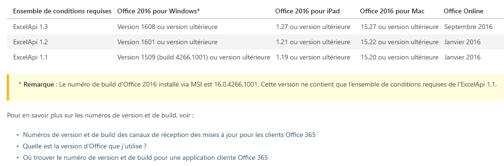
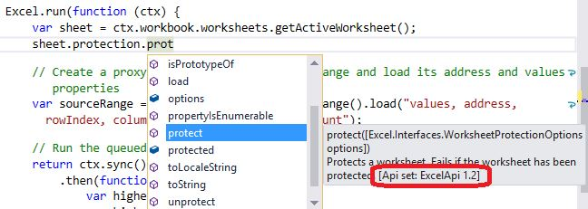

# Contrôle de version de l’API Office.js 

| | |
|:--|:--|
||**Cet article est un extrait de l’ouvrage « [Building Office Add-ins using Office.js](https://leanpub.com/buildingofficeaddins) » (Création de compléments Office à l’aide d’Office.js) de Michael Zlatkovsky, disponible à l’achat au format électronique sur [LeanPub.com](https://leanpub.com/buildingofficeaddins). (en anglais)**  Copyright © 2016-2017 par Michael Zlatkovsky, tous droits réservés.|

Il existe plusieurs aspects du contrôle de version de la bibliothèque Office.js.

## Fichiers JavaScript 

Tout d’abord, il y a le contrôle de version des **fichiers source JavaScript** réels.  Heureusement, cette partie est relativement simple : vous **souhaitez toujours disposer des derniers fichiers Office.js de production**, qui sont facilement accessibles via le CDN : https://appsforoffice.microsoft.com/lib/1/hosted/Office.js.

En plus du CDN, les fichiers Office.js de production sont également fournis sous forme de package NuGet pour permettre le développement derrière un pare-feu d’entreprise ou le développement hors connexion.  Cela dit, le NuGet peut être en retard de plusieurs semaines par rapport au CDN, et les compléments liés au Store sont *requis* pour faire référence à l’emplacement CDN de production.  Ainsi, en ce qui concerne les versions Office.js, le contrôle de version des fichiers JS réels n’est pas réellement intéressant : la meilleure solution est de loin de faire référence à la version CDN requise par le Store, persistante, fréquemment mise à jour et toujours à compatibilité descendante.

## Fonctionnalités d’hôte 

Les **fonctionnalités API réelles qui vous sont proposées par chaque hôte** constituent la partie la plus intéressante pour le contrôle de version.  Ce n’est pas parce que vous disposez de la dernière version de JavaScript que les clients plus anciens seront en mesure de l’utiliser dans son intégralité.  Certains de vos clients utilisent peut-être les versions les plus récentes d’Office mais d’autres non.  En particulier, Office 2016 RTM aura toujours accès à l’ensemble des API Office 2016 d’origine uniquement.  Même les clients qui possèdent des versions d’abonnement d’Office (Office 365/Démarrer en un clic) continuent peut-être à utiliser d’anciennes versions de la version supposée persistante, selon qu’ils sont sur le *canal actuel* ou le *canal différé* d’Office 365.  C’est à l’intersection du contrôle de version d’application natif et du contrôle de version JavaScript que les choses se compliquent.

Les *ensembles de conditions requises* constituent la solution de cette complexité (bien que complexe en soi).  Par exemple, si vous examinez la documentation relative aux [ensembles d’API Excel](https://dev.office.com/reference/add-ins/requirement-sets/excel-api-requirement-sets), vous verrez que la vague 2016 des API Excel a eu trois versions depuis décembre 2016 :  1.1, 1.2 et 1.3.  ExcelApi 1.1 a été fourni avec Office 2016 RTM en septembre 2015 ; 1.2 début mars 2016 ; et 1.3 en octobre 2016.  Chaque version de l’ensemble d’API a une version hôte d’Office correspondante qui prend en charge cet ensemble d’API. Les numéros de version sont répertoriés dans le tableau et des liens sont fournis sous le tableau pour voir à quelle date correspondent les numéros de version.

L’image suivante illustre le tableau. Reportez-vous à la rubrique relative aux [ensembles de conditions requises des API JavaScript Excel](../../reference/requirement-sets/excel-api-requirement-sets.md) pour consulter le contenu le plus récent.

Chacune des versions d’ensemble d’API contient un nombre de fonctionnalités relativement volumineux, ainsi que des améliorations incrémentielles des fonctionnalités existantes.  La rubrique pour chaque ensemble de conditions requises, telle que le lien ci-dessus, fournit une liste détaillée de chacune de ces fonctionnalités.  Lors de la programmation, si vous utilisez JavaScript ou TypeScript IntelliSense, vous devriez être en mesure de voir les versions de chacune de vos API affichées dans IntelliSense :

Vous pouvez utiliser l’ensemble de conditions requises de deux manières.  Vous pouvez déclarer dans le manifeste : « J’ai besoin de l’ensemble d’API ExcelApi 1.2, sinon mon complément ne fonctionne pas du tout ». Jusque-là tout va bien, mais ensuite vous ne pouvez pas utiliser les hôtes plus anciens, votre complément ne s’affichera donc même pas à cet endroit.  Par ailleurs, si votre complément *peut* fonctionner dans un environnement 1.1, mais que vous souhaitez *activer* des fonctionnalités supplémentaires sur des hôtes plus récents qui le prennent en charge, vous pouvez utiliser le manifeste pour déclarer uniquement les ensembles d’API minimaux dont vous avez besoin (par exemple, ExcelApi 1.1) et effectuer ensuite des vérifications à l’exécution pour rechercher des numéros de version supérieurs via l’API `isSetSupported`.

Par exemple, supposons que vous exportez des données dans une nouvelle feuille et que vous souhaitez les ajuster à la largeur de colonne, mais que cette fonctionnalité n’est disponible que dans ExcelApi 1.2.  Au lieu de bloquer l’exécution du complément sur un hôte plus ancien, vous pouvez effectuer un scénario d’activation sur des hôtes plus récents qui prennent en charge l’API et ignorer les fonctionnalités autrement :

**Fonctionnalité d’activation pour un ensemble d’API plus récent**

~~~
Excel.run(context => {
    let data = [
        ["Name", "Phone number"]
        ["Joe Doe", "425-123-4567"],
        ...
    ]
    let newSheet = workbook.worksheets.add();
    let dataRange = newSheet.getCell(0, 0)
        .getResizedRange(values.length - 1, values[0].length - 1);
    dataRange.values = data;
    
    // markua-start-insert
    if (Office.context.requirements.isSetSupported("ExcelApi", 1.2)) {
        dataRange.format.autofitColumns();
    }
    // markua-end-insert
    
    await context.sync();
})
~~~

> **Important :** les numéros de version sont propres à chaque *ENSEMBLE D’API* ; en clair : les numéros de version tels que `ExcelApi 1.3` sont relatifs *à l’ensemble d’API lui-même* mais n’ont rien à voir avec les numéros de version de Office.js ou d’autres ensembles d’API.  Les différents ensembles de conditions requises évoluent à des vitesses totalement différentes (ce qui est pertinent : cela ne vous plairait pas que les API Excel soient retardées de quelques mois, simplement pour que l’ensemble 1.3 d’Excel soit fourni en même temps en tant que l’ensemble 1.3 de Word). Pour cette raison, Office.js est composé de différents numéros de version d’ensemble d’API à un moment donné.  Par conséquent, même si `ExcelApi 1.3` existe, ***il n’existe pas d’Office.js 1.3***.  C’est toujours le point de terminaison Office unique persistant et divers ensembles d’API de versions qui le comprennent.

## Point de terminaison Bêta 

Outre le CDN de production, il existe également un point de terminaison **bêta** ; avec la même URL, mais avec « beta » à la place de « 1 ». Par conséquent, l’URL bêta complète est https://appsforoffice.microsoft.com/lib/**beta**/hosted/Office.js

Avant de décrire ce point de terminaison bêta, il est intéressant d’expliquer le cycle de vie général d’une API.  Il ressemble à ceci :

1. Avant le début de l’implémentation, les conditions requises et les demandes de fonctionnalités sont collectées via un grand nombre de canaux (UserVoice, StackOverflow, conversations avec des partenaires, etc.).
2. À partir de ces conditions requises, l’équipe choisit des zones de fonctionnalités (groupes de fonctionnalités API associées) sur lesquelles elle va se concentrer pour la prochaine version (où la « version » est un incrément d’un ensemble d’API, généralement espacé de 3 à 4 mois). Les API sont ensuite conçues et répétées.
3. Lorsque la conception est prête, et environ au début de l’implémentation, les spécifications de l’API sont publiées dans le cadre du processus d’« ouverture des spécifications » (<https://dev.office.com/reference/add-ins/openspec>) et les commentaires des membres de la communauté sont collectés (puis intégrés à la conception ; plus nous obtenons les commentaires rapidement, mieux c’est). Les API peuvent également être développées pour inclure des fonctionnalités associées, ou modifiées en fonction des contraintes d’implémentation.
4. L’implémentation est terminée. Cependant, il se peut que la version réelle de l’ensemble d’API complet ne soit prête que dans quelques mois.  C’est là que le processus **bêta** intervient : pour les personnes qui travaillent sur les versions Office Insider Fast, il est possible d’obtenir les API et de les utiliser quelques mois avant leur déploiement en production.  Ceci est utile pour les développeurs qui peuvent anticiper et être prêts avec de nouvelles fonctionnalités une fois que l’API est rendue publique. Ceci peut également servir de catalyseur pour communiquer des commentaires sur l’utilisation réelle de l’API, au lieu de simplement l’imaginer sous forme de spécifications.
5. Quelques temps plus tard, l’API intègre la vague suivante des ensembles d’API et est mise à la disposition du monde entier.

Pour utiliser le point de terminaison bêta, modifiez la référence de script et essayez certaines API qui apparaissent dans le processus d’ouverture des spécifications.  Certaines sont peut-être prêtes, d’autres non.  Si vous rencontrez une erreur d’exécution JavaScript pour l’optimisation d’une fonction ou d’un objet inexistant, cela ne fait pas encore partie du point de terminaison bêta. Si le JavaScript est correct mais que vous obtenez une erreur « `ApiNotFound` », vous ne disposez pas d’une version suffisamment récente (ou peut-être que la version en question n’existe pas encore).  Les canaux Bureau et parfois Office Online sont les deux premiers canaux où les API sont disponibles lors de la phase bêta. Les autres plateformes risquent de recevoir les API uniquement après leur déploiement en production.

Le point de terminaison bêta présente quelques inconvénients :

* Il est fondamentalement plus expérimental de nature et ne doit *pas* être utilisé en production.
* Les nouvelles API qui y figurent sont en mode Aperçu et peuvent changer à tout moment.  Les modifications éventuelles incluent l’attribution d’un nouveau nom, le report (passage à un ensemble d’API ultérieur) ou la suppression ou la modification de l’API.
* Une API fait partie de la version d’un ensemble d’API activement créée (pas encore publique), mais `isSetSupported`ladite version sera renvoyée `false` (indépendamment de la production ou du JavaScript bêta), vous ne pourrez donc pas effectuer cette vérification pour les nouvelles API, tant qu’elle n’est pas effectuée en production.

Ceci étant dit :  Au fur et à mesure que vous vous familiarisez avec la plateforme, et notamment que vous découvrez des fonctionnalités disponibles en version bêta qui vous intéressent, je vous encourage vivement à participer au processus de commentaires et d’utiliser le point de terminaison bêta afin de confirmer que la conception répond à vos besoins.  Comme toujours, les questions ou commentaires sur StackOverflow concernant les API (production ou bêta) sont toujours les bienvenus.

### Conseil : Écriture de `isSetSupported` pour le point de terminaison bêta

Comme indiqué précédemment, les API en version bêta n’afficheront pas `isSetSupported` comme `true` tant que la fonctionnalité n’est pas prête pour la production (reportez-vous à la section suivante).  D’un autre côté, que se passe-t-il si vous souhaitez écrire le code comme vous le feriez pour la production, sans changer une ligne (autrement dit, sans avoir à revenir en arrière et supprimer les commentaires des instructions `if` précédemment commentées ?)

Mon astuce : continuez et écrivez vos vérifications `isSetSupported` et instructions `if` comme vous le feriez pour une API de production normale.  Accédez à votre page HTML principale (dont vous avez idéalement deux copies : une pour la production et une pour le développement, où vous pouvez référencer le CDN bêta) et écrivez la balise de script suivante directement sous votre référence CDN bêta (supposons que l’ensemble des API qui vous intéresse est `ExcelApi` ; et que vous souhaitez effectivement afficher *n’importe quelle* nouvelle API comme si elle était entièrement prise en charge à des fins de test) :

~~~
   (function() {
     var originalIsSetSupported = Office.requirements.isSetSupported;
     Office.requirements.isSetSupported = function (apiSet, version) {
       if (apiSet === 'ExcelApi') { return true; }
       return originalIsSetSupported(apiSet, version);
     };
   })();
~~~

En fait, le script ci-dessus renverra `true` pour toute API appartenant à l’ensemble d’API duquel vous souhaitez la dernière fonctionnalité bêta (dans ce cas, `ExcelApi`) et sinon, vous redirigera vers la fonction `isSetSupported` d’origine.

## Comment savoir qu’une API est « prête pour la production » ? 

Une API est prête pour la production lorsque vous consultez IntelliSense, que vous constatez que la version d’ensemble d’API à laquelle l’API est censée appartenir est affichée et que vous lancez `isSetSupported` sur ce numéro de version et que l’opération renvoie `true`.

Ce moment doit correspondre à peu près à :

* Affichage de l’API dans la documentation et non plus sous une spécification ouverte.
* Affichage de son IntelliSense dans un endroit public tel que [DefinitelyTyped](https://github.com/DefinitelyTyped/DefinitelyTyped/blob/master/office-js/index.d.ts).

Notez que certaines plateformes peuvent être en avance par rapport à d’autres. Les versions de bureau sont généralement en avance.  Ainsi, le simple fait que `isSetSupported` renvoie `true` sur la version de bureau ne signifie pas qu’il renverra nécessairement `true` sur Mac au même moment (même si c’est généralement le cas au bout d’un mois ou deux).  Toutefois, la cadence différente d’implémentation explique précisément pourquoi `isSetSupported` (et/ou la spécification des conditions requises basée sur le manifeste) est nécessaire en premier lieu.  Dans la mesure où vous placez des fonctionnalités d’activation avec `isSetSupported`, ou ajoutez la condition requise du manifeste, vous ne devez pas vous soucier du type d’API disponible et du moment où il est disponible. Lorsque la fonctionnalité est disponible sur la plateforme donnée, votre complément « fonctionne » à cet endroit.

>**Cet article est un extrait de l’ouvrage « [Building Office Add-ins using Office.js](https://leanpub.com/buildingofficeaddins) » (Création de compléments Office à l’aide d’Office.js) de Michael Zlatkovsky**. Pour en savoir plus, achetez le livre électronique en ligne sur [LeanPub.com](https://leanpub.com/buildingofficeaddins).
