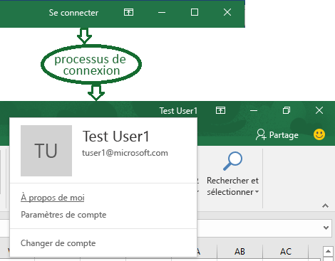
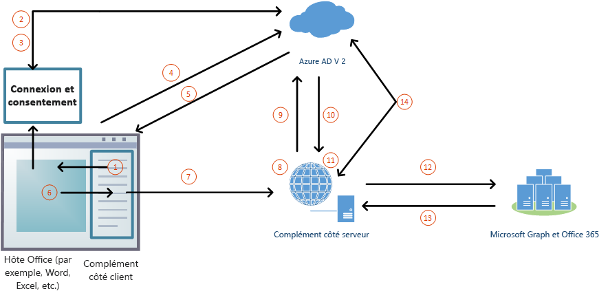

# <a name="enable-single-sign-on-for-office-add-ins-preview"></a>Activer l’authentification unique pour des compléments Office (aperçu)

Vous pouvez tirer parti du fait que les utilisateurs peuvent se connecter à Office (plates-formes en ligne, mobiles et de bureau), et qu’ils peuvent le faire avec leur compte Microsoft personnel ou leur compte scolaire ou professionnel (Office 365). 



Votre complément peut utiliser l’authentification unique pour procéder comme suit - sans que l’utilisateur ait à se connecter une deuxième fois :

* Autorisez l’utilisateur dans votre complément.
* Autorisez le complément à accéder à [Microsoft Graph](https://developer.microsoft.com/graph/docs). 

>**Remarque :** Cette fonctionnalité est encore en phase préliminaire et est sujette à modifications dans les versions ultérieures. Pour cette version préliminaire, l’authentification unique est prise en charge uniquement pour les comptes professionnels ou scolaires (Office 365) et uniquement pour les versions de bureau d’Office. 

Pour les utilisateurs, cela permet une exécution aisée de votre complément qui implique au maximum un écran de consentement unique. Pour les développeurs, cela signifie que l’utilisation de votre complément permet d’authentifier les utilisateurs et d’obtenir un accès autorisé aux données de l’utilisateur via Microsoft Graph avec les informations d’identification que l’utilisateur a déjà fournies à l’application Office.
 

### <a name="sso-add-in-architecture"></a>Architecture des compléments d’authentification unique

Outre l’hébergement des pages et du JavaScript de l’application Web, le complément doit également héberger, dans le même [nom de domaine complet](https://msdn.microsoft.com/en-us/library/windows/desktop/ms682135(v=vs.85).aspx#_dns_fully_qualified_domain_name_fqdn__gly), une ou plusieurs API Web qui recevront un jeton d’accès à Microsoft Graph et effectueront des requêtes.

Le manifeste du complément contient un balisage qui spécifie comment le complément est enregistré dans le point de terminaison Azure Active Directory (Azure AD) v2.0 et il indique les autorisations à Microsoft Graph dont le complément a besoin.

### <a name="how-it-works-at-runtime"></a>Mode de fonctionnement en cours d’exécution

Le diagramme suivant illustre le mode de fonctionnement du processus d’authentification unique. 
<!-- Minor fixes to the text in the diagram - change V2 to v2.0, and change "(e.g. Word, Excel, etc.)" to "(for example, Word, Excel)". -->


1. JavaScript dans le complément appelle une nouvelle API Office.js `getAccessTokenAsync`. Cela indique à l’application hôte Office qu’elle doit obtenir un jeton d’accès au complément. (Ci-après, également appelé « jeton de complément ».)
1. [Se produit uniquement si nécessaire] Si l’utilisateur n’est pas connecté, l’application hôte Office ouvre une fenêtre contextuelle pour que l’utilisateur se connecte. 
1. [Se produit uniquement si nécessaire] Si c’est la première fois que l’utilisateur utilise votre complément, il est invité à donner son consentement. 
1. L’application hôte Office demande le jeton de complément au point de terminaison Azure AD v2.0 pour l’utilisateur actuel.
1. Azure AD envoie le jeton de complément à l’application hôte Office.
1. L’application hôte Office envoie le jeton de complément au complément dans le cadre de l’objet de résultat renvoyé par l’appel `getAccessTokenAsync`.
1. Un code JavaScript dans le complément effectue une requête HTTP à une API web qui est hébergée sur le même domaine complet que le complément et inclut le jeton de complément comme preuve d’autorisation.  
1. Le code côté serveur valide le jeton de complément entrant.
1. Le code côté serveur utilise le flux « de la part de » (défini dans [OAuth2 Token Exchange](https://tools.ietf.org/html/draft-ietf-oauth-token-exchange-02) et l’[application de démon ou de serveur dans un scénario Azure avec une API web](https://docs.microsoft.com/en-us/azure/active-directory/develop/active-directory-authentication-scenarios#daemon-or-server-application-to-web-api)) pour obtenir un jeton d’accès à Microsoft Graph (ci-après, le « jeton MSG ») en échange du jeton de complément. 
1. Azure AD renvoie le jeton MSG (et un jeton d’actualisation, si le complément demande l’autorisation *offline_access*) au complément.
1. Le code côté serveur met en cache les jetons.
1. Le code côté serveur effectue des requêtes à Microsoft Graph et inclut le jeton MSG.
1. Microsoft Graph renvoie des données au complément, qui peut les transmettre à l’interface utilisateur du complément. 
1. [Se produit si nécessaire] Lorsque le jeton MSG arrive à expiration, le code côté serveur peut utiliser son jeton d’actualisation pour obtenir un nouveau jeton MSG.

### <a name="develop-an-sso-add-in"></a>Développer un complément d’authentification unique

Les sections suivantes décrivent les tâches impliquées dans la création d’un complément Office qui utilise l’authentification unique. Ces tâches sont décrites ici indépendamment du langage et de l’infrastructure. Des liens vers des procédures pas à pas détaillées sont disponibles ci-dessous.

#### <a name="create-the-service-application"></a>Créer l’application de service

Enregistrez le complément sur le portail d’inscription pour le point de terminaison Azure v2.0 : https://apps.dev.microsoft.com. Il s’agit d’un processus de 5 à 10 minutes qui inclut les tâches suivantes :

* Obtenez un ID de client et un code secret pour le complément.
* Spécifiez les autorisations dont votre complément a besoin pour Microsoft Graph.
* Accordez la confiance de l’application hôte Office au complément.
* Pré-autorisez l’application hôte Office pour le complément avec l’autorisation par défaut *access_as_user*.

#### <a name="configure-the-add-in"></a>Configurer le complément

Ajoutez un nouveau balisage au manifeste du complément :

* **WebApplicationID** - l’ID de client du complément.
* **WebApplicationResource** - l’URL du complément.
* **WebApplicationScopes** - Indique les autorisations dont l’hôte Office a besoin pour le complément et dont le complément a besoin pour Microsoft Graph. En règle générale, vous souhaiterez toujours *User.Read*, mais vous pourrez demander un accès supplémentaire (comme *Mail.Read* ou *offline_access*).

#### <a name="add-client-side-code"></a>Ajouter du code côté client

Ajoutez un code JavaScript pour le complément à :

* Appel `Office.context.auth.getAccessTokenAsync(myTokenHandler)`.
* Créez un gestionnaire qui transmet le jeton de complément au code côté serveur du complément. Par exemple :

```js
function mytokenHandler(asyncResult) {
    // Passes asyncResult.value (which has the add-in access token)
    // to the add-in’s web API as an Authorization header.
}
```

#### <a name="add-server-side-code"></a>Ajouter du code côté serveur

Créez une ou plusieurs méthodes API Web qui obtiennent des données Microsoft Graph. Selon votre langue et votre infrastructure, des bibliothèques peuvent être disponibles pour simplifier le code à rédiger. Votre code côté serveur doit effectuer les opérations suivantes :

* Valider le jeton de complément reçu à partir du gestionnaire de jetons que vous avez créé précédemment.
* Démarrer le flux « de la part de » avec un appel du point de terminaison Azure AD v2.0 qui inclut le jeton d’accès du complément, certaines métadonnées relatives à l’utilisateur et les informations d’identification du complément (ID et code secret). 
* Mettre en cache le jeton MSG renvoyé.
* Obtenir des données à partir de Microsoft Graph en utilisant le jeton MSG.

### <a name="walkthroughs"></a>Procédures pas à pas

* [Créer un complément Office Node.js qui utilise l’authentification unique](../../docs/develop/create-sso-office-add-ins-nodejs.md)
* [Créer un complément Office ASP.NET qui utilise l’authentification unique](../../docs/develop/create-sso-office-add-ins-aspnet.md)


