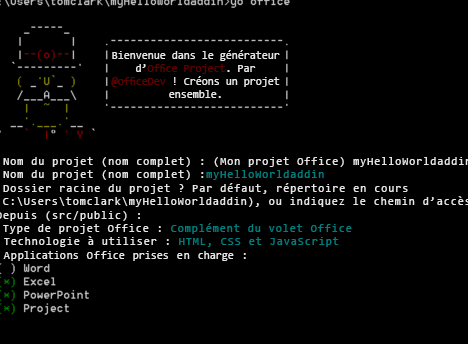

# <a name="create-an-office-add-in-using-any-editor"></a>Créer un complément Office à l’aide d’un éditeur

Vous pouvez utiliser le générateur Yeoman pour votre complément Office. Le générateur Yeoman fournit la structure du projet et assure la gestion des builds. Le fichier `manifest.xml` indique à l’application Office où se trouve votre complément et la façon dont vous voulez qu’il s’affiche. L’application Office l’héberge dans Office.

 >**Remarque :** ces instructions utilisent l’invite de commande Windows, mais vous pouvez également utiliser d’autres environnements d’interpréteur de commandes. 


## <a name="prerequisites-for-yeoman-generator"></a>Configuration requise pour le générateur Yeoman

Pour exécuter le générateur Yeoman d’Office, vous avez besoin des éléments suivants :


- [Git](https://git-scm.com/downloads)  
- [npm](https://www.nodejs.org/en/download)
- [Bower](http://bower.io/)
- [Générateur OfficeYeoman](https://www.npmjs.com/package/generator-office)
- [Gulp](http://gulpjs.com/)
- [TSD](http://definitelytyped.org/tsd/)
    
Seuls Git et npm requièrent une installation séparée. Les autres peuvent être installés à l’aide de npm.

Lorsque vous installez Git, vous devez utiliser les valeurs par défaut, mais choisir les options suivantes : 

- Utiliser Git à partir de l’invite de commande Windows
- Utiliser la fenêtre de console par défaut de Windows
    
Installez npm en utilisant les valeurs par défaut. Ouvrez une invite de commandes en tant qu’administrateur, puis installez les autres logiciels globalement :

```
npm install -g bower yo generator-office gulp tsd
```


## <a name="create-the-default-files-for-your-add-in"></a>Créer les fichiers par défaut pour le complément

Avant de développer un complément Office, vous devez tout d’abord créer un dossier pour votre projet, puis exécuter le générateur à partir de là. Le générateur Yeoman s’exécute dans le répertoire où vous souhaitez structurer le projet. 

Dans l’invite de commandes, accédez au dossier parent où vous souhaitez créer le projet. Ensuite, utilisez les commandes suivantes pour créer un dossier nommé  _myHelloWorldaddin_ et y déplacer le répertoire en cours :


```
mkdir myHelloWorldaddin
cd myHelloWorldaddin
```

Utilisez le générateur Yeoman pour créer le complément de votre choix : Outlook, contenu ou volet des tâches. Les étapes décrites dans cet article créent un complément de volet des tâches. Pour exécuter le générateur, entrez l’instruction suivante :


```
yo office
```

Le générateur vous demande d’indiquer les éléments suivants : 


- Le nom du complément - utilisez  _myHelloWorldaddin_ 
- Le dossier racine du projet - utilisez  _current folder_
- Le type de complément - utilisez  _taskpane_
- La technologie utilisée pour créer le complément - utilisez  _HTML, CSS &amp; JavaScript_
- L’application Office prise en charge -- vous pouvez choisir n’importe quelle application
    

**Entrée dans le générateur Yeoman pour un complément**



Ce bloc de code permet de créer la structure et les fichiers de base de votre complément.


## <a name="hosting-your-office-add-in"></a>Héberger votre complément Office

Les compléments Office doivent être traités via le protocole HTTPS ; l’application Office ne chargera pas une application web sous la forme d’un complément via HTTP. Pour développer, déboguer et héberger le complément localement, vous avez besoin d’un moyen de créer et servir une application web utilisant le protocole HTTPS localement. Vous pouvez créer un site HTTPS auto-hébergé via Gulp (décrit dans la section suivante) ou vous pouvez utiliser Azure. 


### <a name="using-a-self-hosted-https-site"></a>Utilisation d’un site HTTPS auto-hébergé

Le plug-in gulp-webserver crée un site HTTPS auto-hébergé. Le générateur Office l’ajoute au fichier gulpfile.js sous forme de tâche nommée serve-static pour le projet qui est généré. Démarrez le serveur web auto-hébergé à l’aide de l’instruction suivante : 


```
gulp serve-static
```

Cette instruction lance un serveur HTTPS à l’adresse https://localhost:8443.


## <a name="develop-your-office-add-in"></a>Développer votre complément Office

Vous pouvez utiliser n’importe quel éditeur de texte pour développer les fichiers de votre complément Office personnalisé.


### <a name="javascript-project-support"></a>Prise en charge du projet JavaScript

Le générateur Office crée un fichier jsconfig.json lors de la création de votre projet. Ce fichier permet de déduire tous les fichiers JavaScript dans votre projet et évite de devoir inclure les blocs de code répétitifs /// <reference path="../App.js" />.

Pour en savoir plus sur le fichier jsconfig.json, rendez-vous sur la page relative au [langage JavaScript](https://code.visualstudio.com/docs/languages/javascript#_javascript-projects-jsconfigjson).


### <a name="javascript-intellisense-support"></a>Prise en charge de JavaScript IntelliSense

En outre, même si vous écrivez du code JavaScript simple, vous pouvez utiliser des fichiers de définition de type TypeScript ( `*.d.ts`) pour bénéficier d’une prise en charge supplémentaire d’IntelliSense. Le générateur Office ajoute un fichier  `tsd.json` aux fichiers créés, avec des références à toutes les bibliothèques tierces utilisées par le type de projet sélectionné.

Après la création du projet avec le générateur Yeoman d’Office, il ne vous reste plus qu’à exécuter la commande suivante pour télécharger les fichiers de définition de type référencés :


```
tsd install
```


### <a name="create-a-hello-world-office-add-in"></a>Création d’un complément Office Hello World


Dans cet exemple, vous allez créer un complément Hello World. L’interface utilisateur du complément est fournie par un fichier HTML pouvant éventuellement fournir une logique de programmation JavaScript. 


### <a name="to-create-the-files-for-a-hello-world-add-in"></a>Pour créer le fichier pour un complément Hello World


- Dans le dossier de votre projet, accédez à _[dossier du projet]/app/home_ (dans cet exemple, il s’agit de myHelloWorldaddin/app/home), ouvrez home.html et remplacez le code existant par le code suivant, qui fournit l’ensemble minimal de balises HTML pour afficher l’interface utilisateur d’un complément.
    
```HTML
        <!DOCTYPE html>  
      <html> 
        <head> 
           <meta charset="UTF-8" /> 
           <meta http-equiv="X-UA-Compatible" content="IE=Edge"/> 
           <link rel="stylesheet" type="text/css" href="program.css" />
         </head> 
   
        <body> 
           <p>Hello World!</p> 
        </body> 
      
       </html> 
```

  
    
- Ensuite, dans le même dossier, ouvrez le fichier home.css et ajoutez le code CSS suivant.
    
```css
     body 
   { 
        position:relative; 
   } 
   li :hover 
   { 
        text-decoration: underline; 
        cursor:pointer; 
   } 
   h1,h3,h4,p,a,li 
   { 
        font-family: "Segoe UI Light","Segoe UI",Tahoma,sans-serif; 
        text-decoration-color:#4ec724; 
   } 
```
    
- Enfin, revenez au dossier du projet parent et assurez-vous que le fichier XML nommé manifest-myHelloWorldaddin.xml contient le code XML suivant.
    
     >**Important :**  La valeur de la balise `<id>` est un GUID créé par le générateur yeoman lorsqu’il génère le projet. Ne modifiez pas le GUID que le générateur yeoman a créé pour votre complément. Si l’hôte est Azure, la valeur `SourceLocation` sera une URL semblable à _https:// [nom de votre application web].azurewebsites.net/[chemin d’accès au complément]_. Si vous utilisez l’option d’auto-hébergement, comme dans cet exemple, l’URL sera _https://localhost:8443 /[chemin d’accès au complément]_.

```XML
     <?xml version="1.0" encoding="utf-8"?> 
   <OfficeApp xmlns="http://schemas.microsoft.com/office/appforoffice/1.1" 
              xmlns:xsi="http://www.w3.org/2001/XMLSchema-instance" 
              xsi:type="TaskPaneApp"> 
   <Id>[GUID-for-your-add-in]</Id> 
   <Version>1.0</Version> 
   <ProviderName>Microsoft</ProviderName> 
   <DefaultLocale>EN-US</DefaultLocale> 
   <DisplayName DefaultValue="myHelloWorldaddin"/> 
   <Description DefaultValue="My first app."/> 
    
   <Hosts> 
     <Host Name="Document"/> 
     <Host Name="Workbook"/> 
   </Hosts>
    
   <DefaultSettings> 
     <SourceLocation DefaultValue="https://localhost:8443/app/home/home.html"/> 
   </DefaultSettings> 
   
   <Permissions>ReadWriteDocument</Permissions>
    
   </OfficeApp> 
```


### <a name="running-the-add-in-locally"></a>Exécution du complément en local


Pour tester votre complément localement, ouvrez votre navigateur et entrez l’URL de votre fichier home.html. Il peut se trouver sur le serveur web ou sur le site HTTPS auto-hébergé. Si vous l’hébergez localement, tapez simplement cette URL dans votre navigateur. Dans cet exemple, il s’agit de `https://localhost:8443/app/home/home.html`. 

L’erreur « Il existe un problème avec le certificat de sécurité de ce site web » apparaît. Sélectionnez « Poursuivre sur ce site Web », puis le texte « Hello World! » s’affiche.


 >**Remarque :**  le complément généré est livré avec un certificat auto-signé et une clé. Ajoutez-les à la liste des certificats de votre autorité de confiance afin que le navigateur n’émette pas d’avertissement concernant le certificat. Reportez-vous à la documentation sur [gulp-webserver](https://www.npmjs.com/package/gulp-webserver) si vous souhaitez utiliser vos propres certificats auto-signés. Pour plus d’informations sur la façon d’approuver un certificat dans OS X Yosemite, consultez [OS X Yosemite : Si votre certificat n’est pas accepté](https://support.apple.com/kb/PH18677?locale=en_US).


## <a name="install-the-add-in-for-testing"></a>Installation du complément dans une application Office

Vous pouvez utiliser le chargement de version test pour installer votre complément pour le tester :

- [Chargement de version test des compléments Office](../testing/create-a-network-shared-folder-catalog-for-task-pane-and-content-add-ins.md)
- [Chargement de version test des compléments Office sur iPad et Mac](../testing/sideload-an-office-add-in-on-ipad-and-mac.md)   
- [Chargement de version test des compléments Outlook](../outlook/testing-and-tips.md)
    

## <a name="debugging-your-office-add-in"></a>Débogage de votre complément Office

Il existe différentes façons de déboguer un complément :


- Vous pouvez utiliser les clients web Office et ouvrir les outils de développement du navigateur, puis déboguer le complément comme toute autre application JavaScript côté client. 
- Si vous utilisez la version bureau d’Office sur Windows 10, vous pouvez [déboguer des compléments à l’aide des outils de développement F12 sur Windows 10](../testing/debug-add-ins-using-f12-developer-tools-on-windows-10.md).
    
## <a name="additional-resources"></a>Ressources supplémentaires


- [Créer et déboguer des compléments Office dans Visual Studio](../../docs/get-started/create-and-debug-office-add-ins-in-visual-studio.md)
    
