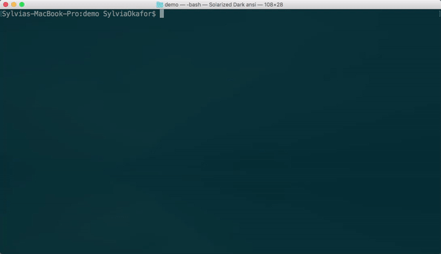
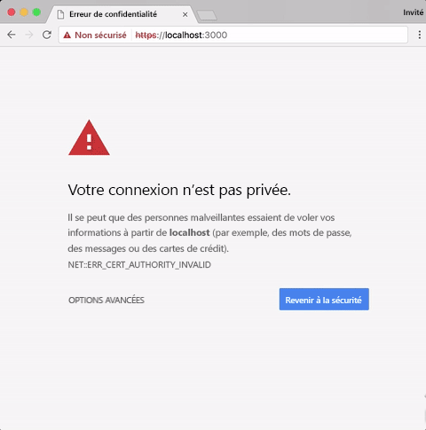
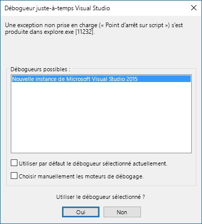

# <a name="create-an-office-add-in-using-any-editor"></a>Créer un complément Office à l’aide d’un éditeur

Vous pouvez utiliser le générateur Yeoman pour votre complément Office. Le générateur Yeoman fournit la structure du projet et assure la gestion des builds. Le fichier `manifest.xml` indique à l’application Office où se trouve votre complément et la façon dont vous voulez qu’il s’affiche. L’application Office l’héberge dans Office.

 >**Remarque :** ces instructions utilisent Terminal sur un Mac, mais vous pouvez également utiliser d’autres environnements de ligne de commande Exchange Management Shell. 


## <a name="prerequisites-for-the-yeoman-generator"></a>Configuration requise pour le générateur Yeoman

Pour installer le générateur Yeoman Office, [git](https://git-scm.com/downloads) et node.js doivent être installés sur votre ordinateur. Si vous utilisez un Mac, nous vous recommandons d’utiliser [Node Version Manager](https://github.com/creationix/nvm) pour installer node.js avec les autorisations appropriées. Si vous utilisez Windows, vous pouvez installer node.js depuis [nodejs.org](https://nodejs.org/en/).

>**Remarque :** si vous êtes sous Windows, utilisez les valeurs par défaut lorsque vous installez git, avec les exceptions suivantes :

>- Utiliser Git à partir de l’invite de commande Windows
>- Utiliser la fenêtre de console par défaut de Windows

Après avoir installé node.js, ouvrez Terminal et installez le générateur de manière globale.

```
npm install -g yo generator-office
```


## <a name="create-the-default-files-for-your-add-in"></a>Créer les fichiers par défaut pour le complément

Le générateur Yeoman s’exécute dans le répertoire où vous souhaitez structurer le projet. Avant de développer un complément Office, vous devez tout d’abord créer un dossier pour votre projet.

Dans Terminal, accédez au dossier parent dans lequel vous voulez créer votre projet. Utilisez ensuite les commandes suivantes pour créer un dossier nommé _myHelloWorldaddin_ et déplacer le répertoire actif vers celui-ci :


```
mkdir myHelloWorldaddin
cd myHelloWorldaddin
```

Utilisez le générateur Yeoman pour créer le complément de votre choix. Les étapes décrites dans cet article créent un complément de volet des tâches simple. Pour exécuter le générateur, entrez la commande suivante :


```
yo office
```

**Entrée dans le générateur Yeoman pour un complément**

Le générateur vous demande d’indiquer les éléments suivants : 


- Nouveau sous-dossier : utilisez _N_
- Nom du complément : utilisez _myHelloWorldaddin_ 
- Application Office prise en charge : vous pouvez choisir n’importe quelle application
- Créer un complément : utiliser _Oui, je souhaite un nouveau complément._
- Ajouter [TypeScript](https://www.typescriptlang.org/) : utiliser _N_
- Choisir l’infrastructure : utiliser _Jquery_




Ce bloc de code permet de créer la structure et les fichiers de base de votre complément.


## <a name="hosting-your-office-add-in"></a>Héberger votre complément Office

Les compléments Office doivent être hébergés via HTTPS, même au cours de leur développement. Yo Office crée un fichier bsconfig.json qui utilise Browsersync pour accélérer le processus d’adaptation et de test de votre complément en synchronisant les modifications de fichier sur plusieurs appareils. 

Lancez le site HTTPS local sur https://localhost:3000 en tapant la commande suivante dans votre console :


```
npm start
```

Browsersync démarre un serveur HTTPS et lance le fichier index.html dans votre projet. Vous verrez une erreur indiquant « Un problème s’est produit avec le certificat de sécurité du site Web. »




Cette erreur se produit, car Browsersync contient un certificat SSL auto-signé que votre environnement de développement doit approuver. Pour plus d’informations sur la résolution de cette erreur, consultez la rubrique relative à l’[ajout de certificats auto-signés](https://github.com/OfficeDev/generator-office/blob/master/src/docs/ssl.md).

## <a name="sideload-the-add-in-into-office"></a>Charger une version test du complément sur Office

Vous pouvez utiliser le chargement de version test pour installer votre complément pour le tester dans les clients Office :

- [Chargement de version test des compléments Office](../testing/create-a-network-shared-folder-catalog-for-task-pane-and-content-add-ins.md)
- [Chargement de version test des compléments Office sur iPad et Mac](../testing/sideload-an-office-add-in-on-ipad-and-mac.md)   
- [Chargement de version test des compléments Outlook](../outlook/testing-and-tips.md)

## <a name="develop-your-office-add-in"></a>Développer votre complément Office

Vous pouvez utiliser n’importe quel éditeur de texte pour développer les fichiers de votre complément Office personnalisé.

> **Important :** Le fichier manifest-myHelloWorldaddin.xml indique aux applications clientes Office comment interagir avec votre complément. La valeur de la balise `<id>` est un GUID créé par Yo Office lorsqu’il génère le projet. Ne modifiez pas le GUID de votre complément. Si l’hôte est Azure, la valeur `SourceLocation` sera une URL semblable à _https:// [nom de votre application web].azurewebsites.net/[chemin d’accès au complément]_. Si vous utilisez l’option d’auto-hébergement, comme dans cet exemple, l’URL sera _https://localhost:3000 /[chemin d’accès au complément]_.


## <a name="debug-your-office-add-in"></a>Déboguer votre complément Office

Vous pouvez déboguer votre complément de plusieurs façons :

- attacher un débogueur à partir du volet Office (Office 2016 pour Windows) ;
- utiliser les outils de développement de votre navigateur ;
- utiliser les outils de développement F12 dans Windows 10.

### <a name="attach-debugger-from-the-task-pane"></a>Attacher un débogueur à partir du volet Office

Dans Office 2016 pour Windows, version 77xx.xxxx ou ultérieure, vous pouvez attacher le débogueur à partir du volet Office. 

Pour lancer l’outil **Attacher le débogueur**, cliquez sur le coin supérieur droit du volet Office pour activer le menu **Caractéristique** (comme illustré dans le cercle rouge dans l’image suivante).   


Sélectionnez **Attacher le débogueur**. Cette action ouvre la boîte de dialogue **Débogueur juste-à-temps Visual Studio**, comme illustré dans l’image suivante. 



Vous pouvez ensuite l’attacher et effectuer le débogage dans Visual Studio.   

  >  **Remarque** :  actuellement, le seul outil de débogage pris en charge est [Visual Studio 2015](https://www.visualstudio.com/downloads/) avec la [mise à jour 3](https://msdn.microsoft.com/en-us/library/mt752379.aspx). Si vous n’avez pas installé Visual Studio, la sélection de l’option **Attacher le débogueur** ne produit aucune action.  
  
Pour plus d’informations, consultez les rubriques suivantes :

-    Pour lancer et utiliser l’explorateur DOM dans Visual Studio, consultez le conseil 4 dans la section relative aux [conseils et astuces](https://blogs.msdn.microsoft.com/officeapps/2013/04/16/building-great-looking-apps-for-office-using-the-new-project-templates/#tips_tricks) du billet de blog sur la [création d’applications attrayantes pour Office à l’aide de nouveaux modèles de projet](https://blogs.msdn.microsoft.com/officeapps/2013/04/16/building-great-looking-apps-for-office-using-the-new-project-templates).
-    Pour définir des points d’arrêt, consultez la rubrique [Utilisation des points d’arrêt](https://msdn.microsoft.com/en-US/library/5557y8b4.aspx).
-    Pour utiliser F12, consultez la rubrique [Utilisation des outils de développement F12](https://msdn.microsoft.com/en-us/library/bg182326(v=vs.85).aspx).

### <a name="browser-developer-tools"></a>Outils de développement du navigateur 

Vous pouvez utiliser les clients web Office et ouvrir les outils de développement du navigateur pour déboguer votre complément comme toute autre application JavaScript côté client. 

### <a name="f12-developer-tools-on-windows-10"></a>Outils de développement F12 sur Windows 10

Si vous utilisez le client de bureau d’Office sur Windows 10, vous pouvez [déboguer des compléments à l’aide des outils de développement F12 sur Windows 10](../testing/debug-add-ins-using-f12-developer-tools-on-windows-10.md).
    
## <a name="additional-resources"></a>Ressources supplémentaires


- [Créer et déboguer des compléments Office dans Visual Studio](../../docs/get-started/create-and-debug-office-add-ins-in-visual-studio.md)
    
