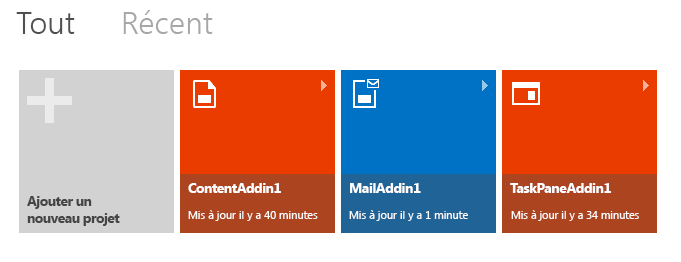
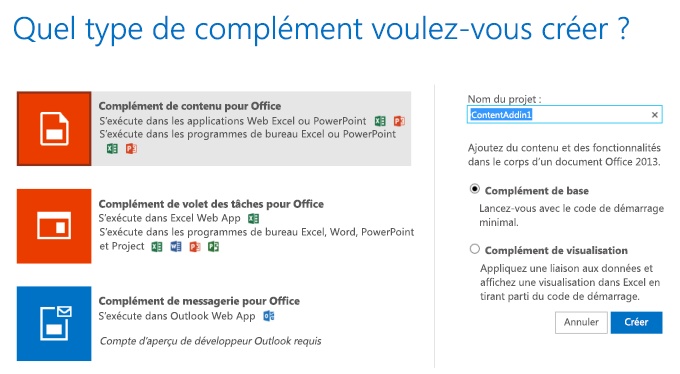

# Créer un complément Office avec Napa

Un [complément pour Office](../../docs/overview/office-add-ins.md) est une application web hébergée dans un contrôle de navigateur ou un IFrame exécuté dans le cadre d’une application Office. Les Compléments peuvent accéder aux données du document ou de l’élément de messagerie en cours, et se connecter à des services web et à d’autres ressources web. Pour développer des compléments, vous devez utiliser des technologies web basées sur des normes, telles que HTML5, JavaScript, CSS3, XML et des API REST. Une complément n’est pas réellement installée sur l’ordinateur exécutant l’application Office hôte, sa mise en œuvre est hébergée sur un serveur web, ce qui vous permet de la maintenir et de la mettre à jour facilement à partir de celui-ci.

Vous pouvez créer un complément Office simple à l’aide de « Napa ». Pour ce faire, il vous faut :

- Un [compte Microsoft](http://www.microsoft.com/en-us/account/default.aspx)
    
- L’URL de l’application web [Napa](https://www.napacloudapp.com)

>**Remarque :** si vous débutez avec les compléments pour OneNote, voir [Créer votre premier complément OneNote](../onenote/onenote-add-ins-getting-started.md).

## Créer un complément de base

1. Ouvrez [Napa](https://www.napacloudapp.com) dans votre navigateur.
    
2. Sélectionnez la vignette  **Ajouter un nouveau projet**.
    
     **Remarque :** La vignette **Ajouter un nouveau projet** ne s’affiche que si vous avez créé d’autres projets. S’il s’agit de votre premier projet, passez à l’étape suivante.
    
    

3. Choisissez le type d’complément que vous voulez créer, attribuez un nom au projet, puis sélectionnez le bouton  **Créer**.
    
    

    L’éditeur de code s’ouvre et affiche la page web par défaut dans laquelle figure déjà du code fourni à titre d’exemple que vous pouvez exécuter tel quel.
    
4. Sur le côté de la page, sélectionnez le bouton Exécuter (
).
    
    L’application Office associée au type de complément que vous avez choisi s’ouvre et le complément fourni à titre d’exemple s’affiche. Vous pouvez maintenant tester les fonctionnalités du complément.
    

## Ressources supplémentaires

- [Présentation des compléments Office](../../docs/overview/office-add-ins.md)
    
- [Laisser des commentaires sur la plateforme de développement Office](http://officespdev.uservoice.com/)
    
- [Poser une question sur les forums Compléments pour Office](http://social.msdn.microsoft.com/Forums/officeapps/en-US/home?forum=appsforoffice%2Cofficestore&amp;filter=alltypes&amp;sort=lastpostdesc)
    
