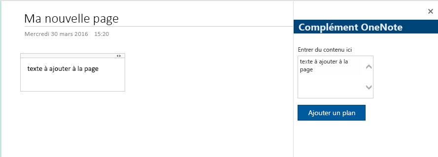
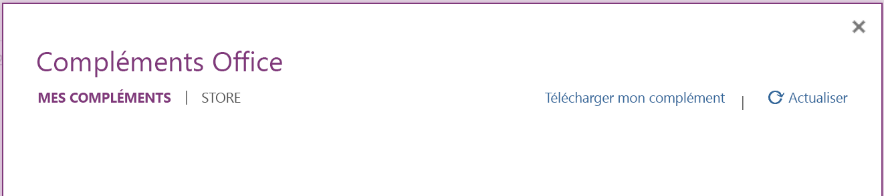
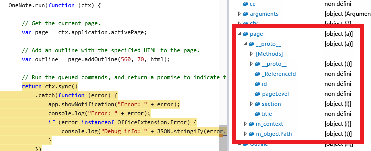

# <a name="build-your-first-onenote-addin"></a>Créer votre premier complément OneNote

Cet article vous guide tout au long de la procédure de création d’un complément de volet de tâches qui permet d’ajouter du texte à une page OneNote.

L’image suivante présente le complément que vous allez créer.

   

<a name="setup"></a>
## <a name="step-1-set-up-your-dev-environment-and-create-an-addin-project"></a>Étape 1 : Configurer votre environnement de développement et créer un projet de complément
Suivez les instructions de la rubrique [Créer un complément Office à l’aide d’un éditeur](../get-started/create-an-office-add-in-using-any-editor.md) pour installer la configuration requise et exécuter le générateur Office Yeoman afin de créer un projet de complément. Le tableau suivant indique les attributs de projet à sélectionner dans le générateur Yeoman.

| Option | Valeur |
|:------|:------|
| Nom du projet | Complément OneNote |
| Dossier racine du projet | (accepter la valeur par défaut) |
| Type de projet Office | Complément de volet de tâches |
| Applications Office prises en charge | (OneNote doit être sélectionné) |
| Technologie à utiliser | HTML, CSS et JavaScript |

<a name="develop"></a>
## <a name="step-2-modify-the-addin"></a>Étape 2 : Modifier le complément
Vous pouvez modifier les fichiers de complément en utilisant un éditeur de texte ou IDE. Si vous n’avez pas encore essayé de Visual Studio Code, vous pouvez le [télécharger gratuitement](https://code.visualstudio.com/) sous Windows, Mac OSX et Linux.

1 - Ouvrez **home.html** dans le dossier *app/home*. 

2 - Modifiez les références à l’API JavaScript d’Office, ainsi que les styles et composants de la [structure de l’interface utilisateur Office](http://dev.office.com/fabric).

  a. Supprimez les marques de commentaires du lien vers fabric.components.min.css.
  
  b. Remplacez la référence de script à Office.js par la référence suivante à la version *bêta*.

```
<script src="https://appsforoffice.microsoft.com/lib/1.1/hosted/office.js"></script>
```

  Vos références Office se présenteront comme suit.

```
<link href="//appsforoffice.microsoft.com/fabric/1.0/fabric.min.css" rel="stylesheet">
<link href="//appsforoffice.microsoft.com/fabric/1.0/fabric.components.min.css" rel="stylesheet">
<script src="https://appsforoffice.microsoft.com/lib/1.1/hosted/office.js"></script>
```

3 - Remplacez l’élément `<body>` par le code suivant. Cette option ajoute une zone de texte et un bouton à l’aide des [composants de la structure de l’interface utilisateur d’Office](http://dev.office.com/fabric/components). La disposition de la **grille dynamique** provient du jeu de styles de la [structure de l’interface utilisateur Office](http://dev.office.com/fabric/styles). 

```html
<body class="ms-font-m">
   <div class="home flex-container">
       <div class="ms-Grid">
           <div class="ms-Grid-row ms-bgColor-themeDarker">
               <div class="ms-Grid-col">
                   <span class="ms-font-xl ms-fontColor-themeLighter ms-fontWeight-semibold">OneNote Add-in</span>
               </div>
           </div>
       </div>
       <br />
       <div class="ms-Grid">
           <div class="ms-Grid-row">
               <div class="ms-Grid-col">
                   <label class="ms-Label">Enter content here</label>
                   <div class="ms-TextField ms-TextField--placeholder">
                       <textarea id="textBox" rows="5"></textarea>
                   </div>
               </div>
           </div>
           <div class="ms-Grid-row">
               <div class="ms-Grid-col">
                   <div class="ms-font-m ms-fontColor-themeLight header--text">
                       <button class="ms-Button ms-Button--primary" id="addOutline">
                           <span class="ms-Button-icon"><i class="ms-Icon"></i></span>
                           <span class="ms-Button-label">Add outline</span>
                           <span class="ms-Button-description">Adds the content above to the current page.</span>
                       </button>
                   </div>
               </div>
           </div>
       </div>
   </div>
</body>
```

4 - Ouvrez **home.js** dans le dossier *app/home*. Modifiez la fonction **Office.initialize** pour ajouter un événement de clic au bouton permettant d’**ajouter un plan**, comme indiqué ci-dessous.

```js
// The initialize function is run each time the page is loaded.
Office.initialize = function (reason) {
   $(document).ready(function () {
       app.initialize();
       
       // Set up event handler for the UI.
       $('#addOutline').click(addOutlineToPage);
   });
};
```
 
5 - Remplacez la méthode **getDataFromSelection** par la méthode **addOutlineToPage** suivante. Cela permet d’obtenir le contenu de la zone de texte et de l’ajouter à la page.

```js
// Add the contents of the text area to the page.
function addOutlineToPage() {        
   OneNote.run(function (context) {
      var html = '<p>' + $('#textBox').val() + '</p>';
      
       // Get the current page.
       var page = context.application.getActivePage();
       
       // Queue a command to load the page with the title property.             
       page.load('title'); 
       
       // Add an outline with the specified HTML to the page.
       var outline = page.addOutline(40, 90, html);
       
       // Run the queued commands, and return a promise to indicate task completion.
       return context.sync()
           .then(function() {
               console.log('Added outline to page ' + page.title);
           })
           .catch(function(error) {
               app.showNotification("Error: " + error); 
               console.log("Error: " + error); 
               if (error instanceof OfficeExtension.Error) { 
                   console.log("Debug info: " + JSON.stringify(error.debugInfo)); 
               } 
           }); 
       });
}
```

<a name="test"></a>
## <a name="step-3-test-the-addin-on-onenote-online"></a>Étape 3 : Test du complément sur OneNote Online
1 - Exécutez le serveur web Gulp.  

  a. Ouvrez une invite **cmd** et accédez au dossier du projet de complément. 
  
  b. Exécutez la commande `gulp serve-static`, comme illustré ci-dessous.

  ```
  C:\your-local-path\onenote add-in\> gulp serve-static
  ```

2 - Installez le certificat auto-signé du serveur web Gulp en tant que certificat approuvé. Vous ne devrez effectuer cette opération qu’une seule fois sur votre ordinateur pour l’ensemble des projets de compléments créés avec le générateur Office Yeoman.

   a. Accédez à la page de complément hébergée. Par défaut, il s’agit de la même URL que celle qui se trouve dans votre manifeste :

  ```
  https://localhost:8443/app/home/home.html
  ```

   b. Installez le certificat en tant que certificat approuvé. Pour plus d’informations, voir la rubrique relative à l’[ajout de certificats auto-signés en tant que certificats racine approuvés](https://github.com/OfficeDev/generator-office/blob/master/docs/trust-self-signed-cert.md).

3 - Accédez à [OneNote Online](https://www.onenote.com/notebooks) et ouvrez le Bloc-notes.

4 - Sélectionnez **Insérer > Compléments Office**. Cette action ouvre la boîte de dialogue Compléments Office.

  - Si vous êtes connecté avec votre compte de consommateur, sélectionnez l’onglet **MES COMPLÉMENTS**, puis choisissez **Télécharger mon complément**.
  
  - Si vous êtes connecté avec votre compte professionnel ou scolaire, sélectionnez l’onglet **MON ORGANISATION**, puis choisissez **Télécharger mon complément**. 
  
  L’image suivante montre l’onglet **MES COMPLÉMENTS** pour les blocs-notes de consommateurs.

  

5 - Dans la boîte de dialogue Télécharger le complément, accédez à **manifest-onenote-add-in.xml** dans le dossier de projet, puis choisissez **Télécharger**. Pendant le test, votre fichier manifeste est stocké dans un espace de stockage local du navigateur.

6 - Le complément s’ouvre dans un iFrame à côté de la page OneNote. Entrez du texte dans la zone de texte, puis choisissez **Ajouter un plan**. Le texte que vous avez entré est ajouté à la page. 

## <a name="troubleshooting-and-tips"></a>Conseils et résolution des problèmes
- Vous pouvez déboguer le complément à l’aide des outils de développement de votre navigateur. Lorsque vous utilisez le serveur web Gulp et le débogage dans Internet Explorer ou Chrome, vous pouvez enregistrer les modifications localement et simplement actualiser l’iFrame du complément.

- Lorsque vous examinez un objet OneNote, les propriétés qui sont actuellement disponibles affichent les valeurs réelles. Les propriétés qui doivent être chargées sont affichées comme *non définies*. Développez le nœud `_proto_` pour visualiser les propriétés qui sont définies sur l’objet, mais qui ne sont pas encore chargées.



- Vous devez activer le contenu mixte dans le navigateur si votre complément utilise des ressources HTTP. Les compléments de production doivent uniquement utiliser des ressources HTTPS sécurisées.

- Les compléments de volet Office peuvent être ouverts à partir de n’importe quel emplacement, mais les compléments de contenu peuvent uniquement être insérés à l’intérieur d’un contenu de page normal (et non dans des titres, des images, des iFrames, etc.). 

## <a name="additional-resources"></a>Ressources supplémentaires

-[Vue d’ensemble de la programmation de l’API JavaScript de OneNote](onenote-add-ins-programming-overview.md)

-[Référence de l’API JavaScript de OneNote](../../reference/onenote/onenote-add-ins-javascript-reference.md)

-[Exemple de grille d’évaluation](https://github.com/OfficeDev/OneNote-Add-in-Rubric-Grader)

-[Vue d’ensemble de la plateforme des compléments pour Office](https://dev.office.com/docs/add-ins/overview/office-add-ins)
