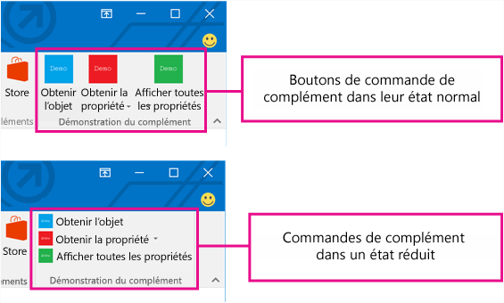
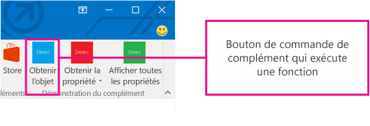
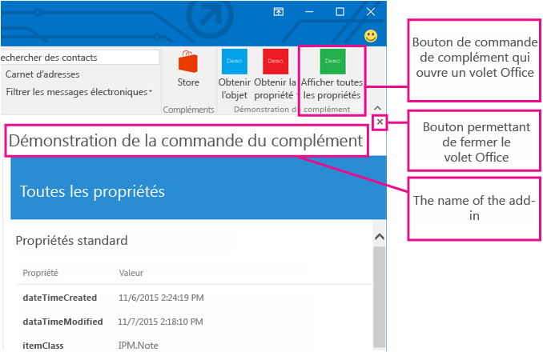
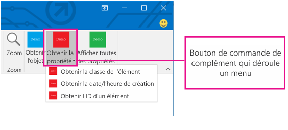

# Commandes de complément pour Outlook

Les commandes de complément Outlook permettent d’initier des actions de complément spécifiques à partir du ruban en ajoutant des boutons ou des menus déroulants. Les utilisateurs peuvent ainsi accéder aux compléments d’une manière simple, intuitive et discrète. Parce qu’elles offrent des fonctionnalités optimales en toute transparence, les commandes de complément vous permettent de créer des solutions plus attrayantes.

> **Remarque** : Les commandes de complément sont disponibles uniquement dans Outlook 2016 et Outlook 2013 pour Windows et Outlook sur le web pour Office 365 et Outlook.com. La prise en charge des commandes de complément dans Outlook 2013 nécessite l’installation de la [mise à jour de sécurité du 8 mars 2016](https://support.microsoft.com/en-us/kb/3114829).

Les commandes de complément sont uniquement disponibles pour les compléments contextuels qui n’utilisent pas les règles [ItemHasAttachment, ItemHasKnownEntity ou ItemHasRegularExpressionMatch](manifests/activation-rules.md) qui limitent les types d’éléments sur lesquels elles s’activent. Toutefois, les compléments contextuels peuvent présenter diverses commandes selon que l’élément actuellement sélectionné est un message ou un rendez-vous, et peuvent apparaître dans des scénarios de lecture ou de composition. L’utilisation des commandes de complément constitue une [meilleure pratique](../../docs/overview/add-in-development-best-practices.md).

## Création d’une commande de complément

Les commandes de complément sont déclarées dans le manifeste de complément dans l’élément  **VersionOverrides**. Cet élément est un ajout au schéma de manifeste version 1.1 qui assure la compatibilité descendante. Dans un client qui ne prend pas en charge  **VersionOverrides**, les compléments existants continuent à fonctionner comme ils le feraient sans commande de complément.

Les entrées du manifeste **VersionOverrides** spécifient de nombreux éléments pour le complément, tels que l’hôte, les types de contrôle à ajouter au ruban, le texte, les icônes, ainsi que les fonctions connexes. Pour plus d’informations, voir [Définir des commandes de complément dans votre manifeste de complément Outlook](../outlook/manifests/define-add-in-commands.md). 

Lorsqu’un complément doit fournir des mises à jour d’état, telles que des indicateurs de progression ou des messages d’erreur, il doit le faire à travers les [API de notification](../../reference/outlook/NotificationMessages.md). Le traitement pour les notifications doit également être défini dans un fichier HTML distinct qui est spécifié dans le nœud  **FunctionFile** du manifeste.

Les développeurs doivent définir des icônes pour toutes les tailles nécessaires afin que les commandes de complément puissent s’ajuster parfaitement au ruban. Les tailles d’icônes sont 80 x 80 pixels, 32 x 32 pixels et 16 x 16 pixels.

## Comment les commandes de complément apparaissent-elles ?

Une commande de complément apparaît dans le ruban, comme un bouton. Lorsqu’un utilisateur installe un complément, ses commandes apparaissent dans l’interface utilisateur sous la forme d’un groupe de boutons étiquetés avec le nom du complément. Le groupe peut apparaître dans l’onglet par défaut du ruban ou dans un onglet personnalisé. Pour les messages, il apparaît par défaut dans l’onglet **Accueil** ou **Message**. Pour le calendrier, il apparaît par défaut dans l’onglet **Réunion**, **Occurrence de réunion**, **Série de réunions** ou **Rendez-vous**. Pour les extensions de module, il apparaît par défaut dans un onglet personnalisé. Dans l’onglet par défaut, chaque complément peut avoir un groupe Ruban incluant 6 commandes maximum. Dans les onglets personnalisés, le complément peut avoir jusqu’à 10 groupes, avec 6 commandes chacun. Les compléments sont limités à un seul onglet personnalisé.

À mesure que les éléments s’ajoutent sur le ruban, les commandes de complément s’ajustent (sont réduites) de manière ordonnée. Dans tous les cas, elles sont regroupées par complément.

Lorsqu’une commande de complément est ajoutée à un complément, le nom du complément est supprimé de la barre d’application. Seul le bouton de commande du complément dans le ruban est conservé.

## Quelles formes d’expérience utilisateur existent pour les commandes de complément ?

La forme d’expérience utilisateur d’une commande de complément inclut un onglet de ruban dans l’application hôte qui contient des boutons permettant d’effectuer diverses actions. Actuellement, trois formes d’expérience utilisateur sont prises en charge :

- Un bouton qui exécute une fonction JavaScript
        
- Un bouton qui affiche un menu déroulant avec un ou plusieurs boutons des deux autres types

De plus, les compléments contextuels prennent en charge : 
- Un bouton qui lance un volet Office

### Exécuter une fonction JavaScript

Utilisez un bouton de commande de complément qui exécute une fonction JavaScript pour les scénarios dans lesquels l’utilisateur n’a pas besoin d’effectuer de sélections supplémentaires pour lancer l’action. Cela peut être utile, entre autres, pour les actions de suivi, de rappel, d’impression ou de scénario quand l’utilisateur souhaite obtenir des informations supplémentaires d’un service. 

Dans les extensions de module, le bouton de commande de complément peut exécuter les fonctions JavaScript qui interagissent avec le contenu de l’interface utilisateur principale.

### Lancement d’un volet Office

Utilisez un bouton de commande de complément pour lancer un volet Office pour les scénarios dans lesquels l’utilisateur doit interagir avec un complément pour une durée plus longue. Par exemple, le complément nécessite des modifications de paramètres ou la saisie de données dans de nombreux champs. 

La largeur par défaut du volet de tâche vertical est de 300 px. Celui-ci peut être redimensionné à la fois dans l’explorateur Outlook et dans l’inspecteur. Le volet peut redimensionner le volet de tâche et l’affichage Liste de façon identique.

Cette capture d’écran montre un exemple de volet des tâches vertical. Le volet s’ouvre avec le nom de la commande du complément dans le coin supérieur gauche. Les utilisateurs peuvent utiliser le bouton **X** situé dans le coin supérieur droit du volet pour fermer le complément lorsqu’ils ont terminé de l’utiliser. Par défaut, ce volet n’est pas conservé sur plusieurs messages. Les compléments peuvent [prendre en charge l’épinglage](./manifests/pinnable-taskpane.md) pour le volet des tâches et recevoir des événements lorsqu’un nouveau message est sélectionné. Tous les éléments d’interface utilisateur affichés dans le volet des tâches, mis à part le nom et le bouton Fermer, sont fournis par le complément.

Si l’utilisateur sélectionne une autre commande de complément qui ouvre un volet Office, le volet est remplacé par la commande qui vient d’être utilisée. Si l’utilisateur sélectionne un bouton de commande de complément qui exécute une fonction ou sur un menu déroulant alors que le volet Office est ouvert, l’action est exécutée et le volet Office reste ouvert.

### Menu déroulant

Une commande de complément de menu déroulant définit une liste statique de boutons. Les boutons dans le menu peuvent correspondre à n’importe quelle combinaison de boutons qui exécutent une fonction ou qui ouvrent un volet Office. Les sous-menus ne sont pas pris en charge.

## Où les commandes de complément apparaissent-elles dans l’interface utilisateur ?

Les commandes de complément sont prises en charge pour quatre scénarios :

### Lecture d’un message

Lorsque l’utilisateur lit un message, les commandes de complément ajoutées à l’onglet par défaut apparaissent dans l’onglet **Accueil** lorsque vous affichez le message dans le volet de lecture et dans l’onglet **Message** pour un formulaire de lecture contextuel.

### Composition d’un message

Lorsque l’utilisateur crée un message, les commandes de complément ajoutées à l’onglet par défaut apparaissent dans l’onglet **Message**.

### Création ou affichage d’un rendez-vous ou d’une réunion en tant qu’organisateur

Lorsque vous créez ou visualisez un rendez-vous ou une réunion en tant qu’organisateur, les commandes de complément ajoutées à l’onglet par défaut apparaissent dans les onglets **Réunion**,  **Occurrence de réunion**,  **Série de réunions** ou **Rendez-vous** des formulaires contextuels. Toutefois, si l’utilisateur sélectionne un élément dans le calendrier sans ouvrir la fenêtre contextuelle, le groupe Ruban du complément n’apparaît pas sur le ruban.

### Affichage d’une réunion en tant que participant

Lorsque vous visualisez une réunion en tant que participant, les commandes de complément ajoutées à l’onglet par défaut apparaissent dans les onglets **Réunion**,  **Occurrence de réunion** ou **Série de réunions** des formulaires contextuels. Toutefois, si l’utilisateur sélectionne un élément dans le calendrier sans ouvrir la fenêtre contextuelle, le groupe Ruban du complément n’apparaît pas sur le ruban.

### Utilisation d’une extension de module

Quand vous utilisez une extension de module, les commandes de complément apparaissent dans l’onglet personnalisé de l’extension.

## Ressources supplémentaires

- [Définir des commandes de complément dans votre manifeste de complément Outlook](../outlook/manifests/define-add-in-commands.md)
    
- [Démonstration de la commande du complément Outlook](https://github.com/jasonjoh/command-demo)
    
