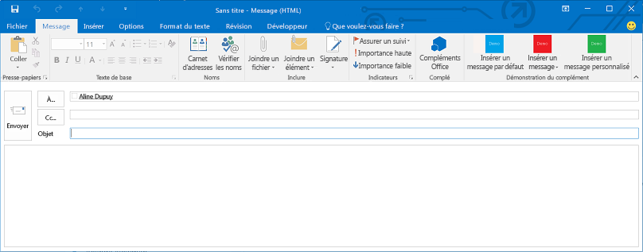
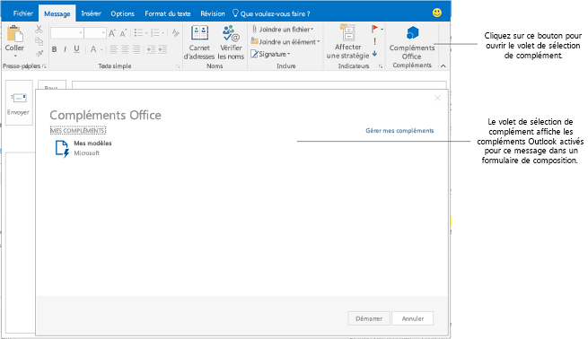

# Créer des compléments Outlook pour les formulaires de composition

À partir de la version 1.1 du schéma pour les manifestes des Compléments Office et office.js, vous pouvez créer des compléments de composition, qui sont des compléments Outlook activés dans les formulaires de composition. Contrairement aux compléments de lecture (qui sont des compléments Outlook activés en mode lecture lorsqu’un utilisateur visualise un message ou un rendez-vous), les compléments de composition sont disponibles dans les scénarios suivants :

- Composition d’un nouveau message, d’une demande de réunion ou d’un rendez-vous dans un formulaire de composition.
    
- Affichage ou modification d’un rendez-vous existant, ou d’un élément de réunion dans lequel l’utilisateur est l’organisateur.
    
     >**Remarque**  Si l’utilisateur utilise la version RTM d’Outlook 2013 et d’Exchange 2013 et qu’il affiche un élément de réunion organisé par l’utilisateur, l’utilisateur peut rechercher les compléments de lecture disponibles. À partir de la version d’Office 2013 SP1, une modification a été apportée. Dans le même scénario, seuls les compléments de composition peuvent être activés et être disponibles.
- Composition d’un message de réponse inline ou réponse à un message dans un formulaire de composition individuel.
    
- Modification d’une réponse ( **Accepter**,  **Provisoire** ou **Refuser**) à une demande de réunion ou à un élément de réunion.
    
- Proposition d’une nouvelle heure pour un élément de réunion.
    
- Transfert d’une demande de réunion ou d’un élément de réunion, ou réponse à une demande de réunion ou un élément de réunion.
    
Dans chacun de ces scénarios de composition, tous les boutons de commande de complément sont affichés. Pour les compléments plus anciens qui n’implémentent pas les commandes de complément, les utilisateurs peuvent sélectionner **Compléments Office** dans le ruban pour ouvrir le volet de sélection des compléments, puis choisir et lancer un complément de composition. La figure suivante présente les commandes de complément dans un formulaire de composition.

La figure suivante présente le volet de sélection des compléments constitué de deux compléments de composition qui n’implémentent pas les commandes de complément, activés quand l’utilisateur compose une réponse instantanée dans Outlook.

## Types de complément disponibles en mode composition

Les compléments de composition sont implémentés en tant que [Commandes de complément pour Outlook](../outlook/add-in-commands-for-outlook.md).

## Fonctionnalités de l’API disponibles pour les compléments de composition

- Pour activer les compléments dans les formulaires de composition, voir le tableau 1 dans : [Spécifier des règles d’activation dans un manifeste](../outlook/manifests/activation-rules.md#specify-activation-rules-in-a-manifest).
    
- [Ajouter et supprimer des pièces jointes à un élément dans un formulaire de composition dans Outlook](../outlook/add-and-remove-attachments-to-an-item-in-a-compose-form.md)
    
- [Obtenir et définir des données d’élément dans un formulaire de composition dans Outlook](../outlook/get-and-set-item-data-in-a-compose-form.md)
    
- [Obtenir, définir ou ajouter des destinataires lors de la composition d’un rendez-vous ou d’un message dans Outlook](../outlook/get-set-or-add-recipients.md)
    
- [Obtenir ou définir l’objet lors de la composition d’un rendez-vous ou d’un message dans Outlook](../outlook/get-or-set-the-subject.md)
    
- [Insérer des données dans le corps lors de la composition d’un rendez-vous ou d’un message dans Outlook](../outlook/insert-data-in-the-body.md)
    
- [Obtenir ou définir l’emplacement lors de la composition d’un rendez-vous dans Outlook](../outlook/get-or-set-the-location-of-an-appointment.md)
    
- [Obtenir ou définir l’heure lors de la composition d’un rendez-vous dans Outlook](../outlook/get-or-set-the-time-of-an-appointment.md)
    
- [Outlook-Power-Hour_Code-Samples](https://github.com/OfficeDev/Outlook-Power-Hour-Code-Samples): `ComposeAppDemo`
    

## Ressources supplémentaires

- [Prise en main des compléments Outlook pour Office 365](https://dev.outlook.com/MailAppsGettingStarted/GetStarted)
    
- [Compléments Outlook](../outlook/outlook-add-ins.md)
    
