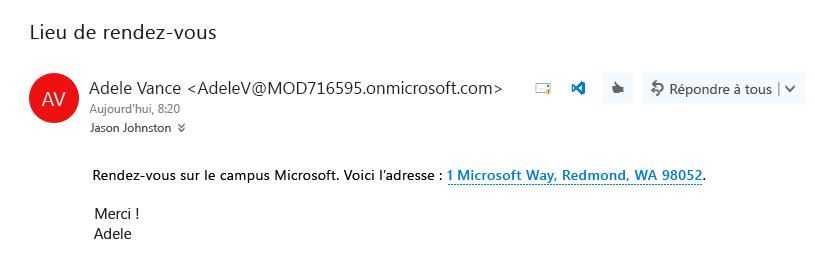
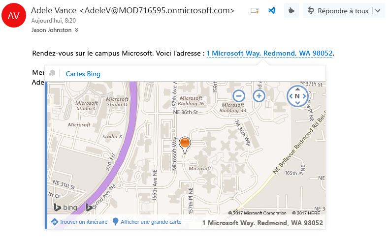

# <a name="contextual-outlook-add-ins"></a>Compléments Outlook contextuels

Les compléments contextuels sont des compléments Outlook qui s’activent en fonction du texte d’un message ou d’un rendez-vous. Grâce aux compléments contextuels, vous pouvez initier des tâches associées à un message sans avoir à quitter le message lui-même. L’expérience utilisateur en est ainsi facilitée et enrichie.

Voici quelques exemples de compléments contextuels :

- Choisir une adresse ouvre une carte de l’emplacement.
- Choisir une chaîne ouvre un complément qui suggère une réunion.
- Choisir un numéro de téléphone permet de l’ajouter à vos contacts.

## <a name="how-to-make-a-contextual-add-in"></a>Création d’un complément contextuel

Le manifeste d’un complément contextuel doit inclure un élément [ExtensionPoint](../../reference/manifest/extensionpoint.md) avec un attribut `xsi:type` défini sur `DetectedEntity`. Dans l’élément **ExtensionPoint**, le complément spécifie l’entité ou l’expression régulière qui peut l’activer. Si vous spécifiez une entité, l’entité peut être l’une des propriétés de l’objet [Entités](../../reference/outlook/simple-types.md) *à l’exception de* `EmailAddress` ou `Url`. Par conséquent, le manifeste du complément doit contenir un type de règle **ItemHasKnownEntity** ou **ItemHasRegularExpressionMatch**. L’exemple suivant montre comment spécifier une entité qui est un numéro de téléphone :

```XML
<Rule xsi:type="ItemHasKnownEntity" EntityType="PhoneNumber" Highlight="all" />
```

Lorsqu’un complément contextuel est associé à un compte, il démarre automatiquement quand l’utilisateur clique sur une entité en surbrillance ou une expression régulière. Pour plus d’informations sur les expressions régulières des compléments Outlook, voir [Utiliser des règles d’activation d’expression régulière pour afficher un complément Outlook](../outlook/use-regular-expressions-to-show-an-outlook-add-in.md).

Il existe plusieurs restrictions sur les compléments contextuels :

- Un complément contextuel ne peut exister que dans des compléments de lecture (pas dans des compléments de composition).
- Vous ne pouvez pas spécifier la couleur de l’entité en surbrillance.
- Si une entité n’est pas en surbrillance, elle ne lancera pas de complément contextuel dans une carte.

Une entité ou une expression régulière qui n’est pas mise en surbrillance ne permettant pas le lancement d’un complément contextuel, les compléments doivent inclure au moins un élément `Rule` avec l’attribut `Highlight` défini sur `all` ou `first`.

## <a name="how-to-launch-a-contextual-add-in"></a>Lancement d’un complément contextuel

Un utilisateur lance un complément contextuel par le biais du texte, une entité connue ou une expression régulière du développeur. En règle générale, un utilisateur identifie un complément contextuel car l’entité est mise en surbrillance. L’exemple suivant montre comment la mise en surbrillance s’affiche dans un message. Ici, l’entité (une adresse) est colorée en bleu et soulignée avec une ligne bleue en pointillés. Un utilisateur lance le complément contextuel en cliquant sur l’entité en surbrillance. 

**Exemple de texte avec l’entité (une adresse) en surbrillance**


    
Lorsque plusieurs entités ou compléments contextuels sont présents dans un message, l’interaction avec l’utilisateur a lieu comme suit :

- S’il existe plusieurs entités, l’utilisateur doit cliquer sur une autre entité pour lancer le complément pour celle-ci.
- Si une entité active plusieurs compléments, chacun d’entre eux s’ouvre dans un nouvel onglet. L’utilisateur bascule entre les onglets, comme dans la barre du complément, pour changer de complément. Par exemple, un nom et une adresse peuvent déclencher un complément téléphonique et un complément de carte géographique.
- Si une chaîne unique contient plusieurs entités qui activent plusieurs compléments, la chaîne entière est mise en surbrillance et lorsque l’utilisateur clique sur cette chaîne, tous les compléments concernés par la chaîne s’affichent dans des onglets distincts. Par exemple, une chaîne qui décrit une proposition de réunion dans un restaurant peut activer le complément de suggestion de réunion et un complément d’avis sur des restaurants.

## <a name="how-a-contextual-add-in-displays"></a>Affichage des compléments contextuels

Un complément contextuel activé s’affiche dans une carte, qui est une fenêtre séparée près de l’entité. La carte s’affiche normalement sous l’entité et au centre par rapport à l’entité autant que possible. S’il n’existe pas suffisamment d’espace en dessous de l’entité, la carte est placée au-dessus. La capture d’écran suivante illustre l’entité en surbrillance et, dessous, un complément activé (Bing Maps) dans une carte.

**Exemple d’un complément affiché dans une carte**



Pour fermer la carte et quitter le complément, il suffit de cliquer en dehors de la carte.

## <a name="current-contextual-add-ins"></a>Compléments contextuels actuels

Les compléments contextuels suivants sont installés par défaut pour les utilisateurs qui utilisent des compléments Outlook :

- Cartes Bing 
- Réunions suggérées

## <a name="additional-resources"></a>Ressources supplémentaires

- [Prise en main des compléments Outlook pour Office 365](https://dev.outlook.com/MailAppsGettingStarted/GetStarted.aspx)
- [Utiliser des règles d’activation d’expression régulière pour afficher un complément Outlook](../outlook/use-regular-expressions-to-show-an-outlook-add-in.md)
- [Objet Entities](../../reference/outlook/simple-types.md)
