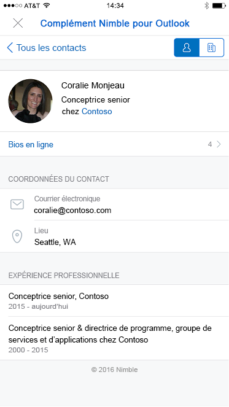
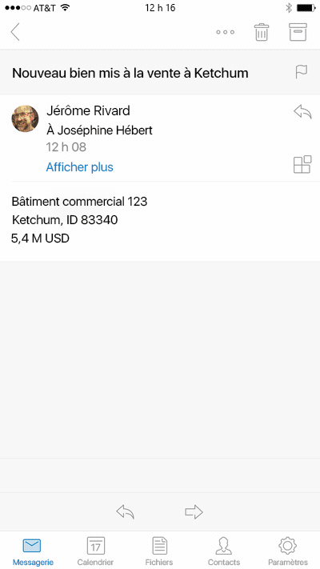

# Compléments pour Outlook Mobile 

> **Remarque :** les compléments sont disponibles sur Outlook pour iOS. Outlook pour Android sera bientôt pris en charge.

Les compléments fonctionnent désormais sur Outlook Mobile, avec les mêmes API que celles disponibles pour d’autres points de terminaison Outlook. Si vous avez déjà créé un complément pour Outlook, il est facile de le faire fonctionner sur Outlook Mobile.

Les compléments Outlook Mobile sont pris en charge sur tous les comptes commerciaux Office 365 et les comptes Outlook.com seront pris en charge très bientôt.

**Exemple de volet de tâches dans Outlook pour iOS**

## Qu’est-ce qui est différent sur mobile ? 

- La taille réduite et la rapidité des interactions compliquent la conception pour les environnements mobiles. Pour garantir la qualité des expériences pour nos clients, nous définissons des critères de validation stricts qui doivent être respectés par un complément qui déclare prendre en charge les environnements mobiles pour être approuvé dans l’Office Store.
    - Le complément **DOIT** respecter les [instructions concernant l’interface utilisateur](./outlook-addin-design.md).
    - Le scénario du complément **DOIT** [être pertinent sur mobile](#what-makes-a-good-scenario-for-mobile-add-ins).
- Seule la lecture du courrier est prise en charge pour l’instant. Cela signifie que `MobileMessageReadCommandSurface` est le seul élément [ExtensionPoint](../../reference/manifest/extensionpoint.md) que vous devez déclarer dans la section mobile de votre manifeste.
- L’API [makeEwsRequestAsync](../../reference/outlook/Office.context.mailbox.md) n’est pas prise en charge sur mobile dans la mesure où l’application mobile utilise les API REST pour communiquer avec le serveur. Si le serveur principal de votre application doit se connecter au serveur Exchange, vous pouvez utiliser le jeton de rappel pour émettre des appels d’API REST. Pour plus d’informations, voir [Utilisation des API REST Outlook à partir d’un complément Outlook](./use-rest-api.md).
- Lorsque vous soumettez votre complément dans le magasin avec l’élément [MobileFormFactor](../../reference/manifest/mobileformfactor.md) dans le manifeste, vous devez accepter notre addendum pour les développeurs de compléments sur iOS, et envoyer votre ID de développeur Apple pour vérification.
- Enfin, votre manifeste devra déclarer l’élément `MobileFormFactor`, et inclure les types corrects de [contrôles](../../reference/manifest/control.md) et de [tailles d’icône](../../reference/manifest/icon.md).

## Qu’est-ce qu’un bon scénario pour les compléments mobiles ?

N’oubliez pas que la durée moyenne d’une session Outlook sur un téléphone est beaucoup plus courte que sur un PC. Cela signifie que votre complément doit être rapide et que le scénario doit permettre à l’utilisateur d’accéder à votre complément, d’en sortir et de traiter ses messages.

Voici quelques exemples de scénarios pertinents dans Outlook Mobile.

- Le complément apporte des informations précieuses dans Outlook et aide les utilisateurs à trier leurs messages et à y répondre correctement. Exemple : un complément CRM qui permet à l’utilisateur de voir les informations client et de partager des informations appropriées.
- Le complément apporte de la valeur ajoutée au contenu des messages de l’utilisateur en enregistrant les informations dans un système de suivi, de collaboration ou de type similaire. Exemple : un complément qui permet aux utilisateurs de transformer les messages électroniques en tâches afin de suivre des projets ou en demandes d’aide pour une équipe de support technique.

Évidemment, bien d’autres scénarios utiles sont possibles, donc si vous avez une idée de complément qui va au-delà de ceux-ci, contactez-nous à l’aide de ce [formulaire](https://aka.ms/outlookmobileaddin) et nous vous dirons si nous pensons qu’il s’agit d’un scénario acceptable pour Outlook Mobile. Nous serons ravis de vous conseiller. N’hésitez pas à nous fournir un maximum d’informations. Nous apprécions les procédures pas à pas pour naviguer dans l’interface utilisateur.

**Exemple d’interaction utilisateur pour créer une carte Trello à partir d’un message électronique**

## Test de vos compléments sur mobile

Pour tester un complément sur Outlook Mobile, vous pouvez charger de manière indépendante un complément sur un compte Office 365 ou Outlook.com. Dans Outlook Web App, accédez à l’icône des paramètres représentant un engrenage, puis choisissez « Gérer les intégrations » ou « Gérer les compléments ». Près de la partie supérieure, cliquez sur l’emplacement qui indique « Cliquez ici pour ajouter un complément personnalisé » et téléchargez votre manifeste. Vérifiez que votre manifeste est correctement mis en forme et qu’il contient `MobileFormFactor`, sinon il ne sera pas chargé.

Une fois que votre complément fonctionne, testez-le sur différentes tailles d’écran, y compris sur des téléphones et des tablettes. Vous devez vous assurer qu’il respecte les instructions d’accessibilité en matière de contraste, de taille de police et de couleur, et qu’il peut être utilisé avec un lecteur d’écran comme VoiceOver sur iOS ou TalkBack sur Android.

La résolution des problèmes sur mobile peut s’avérer difficile, car vous n’avez peut-être pas les outils auxquels vous êtes habitué. Pour résoudre les problèmes, vous pouvez [utiliser Vorlon.js](../testing/debug-office-add-ins-on-ipad-and-mac.md). Sinon, si vous avez déjà utilisé Fiddler, parcourez [ce didacticiel sur l’utilisation de Fiddler avec un appareil iOS](http://www.telerik.com/blogs/using-fiddler-with-apple-ios-devices).

## Étapes suivantes

- Découvrez comment [ajouter la prise en charge mobile au manifeste de votre complément](./manifests/add-mobile-support.md).
- Découvrez comment [concevoir une expérience mobile exceptionnelle pour votre complément](./outlook-addin-design.md).
- Découvrez comment [obtenir un jeton d’accès et appeler des API REST Outlook](./use-rest-api.md) à partir de votre complément.