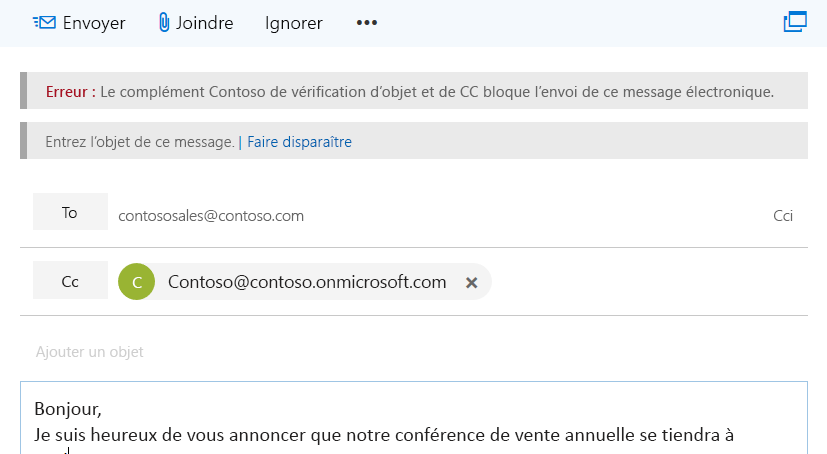
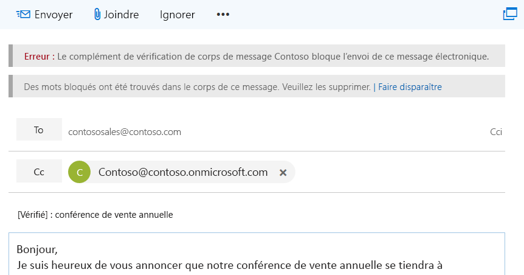

# <a name="on-send-feature-for-outlook-add-ins"></a>Fonctionnalité d’envoi pour les compléments Outlook

La fonctionnalité d’envoi des compléments Outlook vous permet de traiter les messages ou d’empêcher les utilisateurs de la boîte de messagerie d’effectuer certaines actions. Elle permet aussi aux compléments de définir certains éléments pendant l’envoi. Par exemple, vous pouvez utiliser la fonctionnalité d’envoi pour :

- Empêcher un utilisateur d’envoyer des informations sensibles ou de laisser la ligne d’objet vide.  
- Ajouter un destinataire spécifique dans la ligne Cc.

>  **Remarque :** la fonctionnalité d’envoi est actuellement prise en charge par Outlook Web App dans Office 365 uniquement. Elle sera prochainement prise en charge dans d’autres plateformes. Les compléments qui utilisent la fonctionnalité d’envoi ne sont pas autorisés dans l’Office Store.

La fonctionnalité d’envoi se déclenche via les événements. Actuellement, la fonctionnalité prend en charge le type d’événement **ItemSend**. Les événements dans les compléments Outlook vous permettent de gérer, de vérifier ou de bloquer les actions des utilisateurs lorsqu’un événement se produit. Par exemple, vous pouvez :

- Contrôler les actions des utilisateurs
- Gérer les modifications
- Signaler les actions des utilisateurs, tels que les clics
- Vérifier les données saisies
- Valider le contenu d’un message    

Pour en savoir plus sur les limites de la fonctionnalité d’envoi, consultez la section [Limites](#limitations) plus loin dans cet article.

## <a name="how-does-the-on-send-feature-work"></a>Comment fonctionne la fonctionnalité d’envoi ?

Vous pouvez utiliser la fonctionnalité d’envoi pour créer un complément Outlook qui intègre l’événement synchrone **ItemSend** . Cet événement détecte le moment où l’utilisateur clique sur le bouton **Envoyer** et peut servir à bloquer l’envoi du message s’il n’est pas validé. Par exemple, quand un utilisateur déclenche un événement d’envoi de message, un complément Outlook qui utilise la fonctionnalité d’envoi peut :

- Lire et valider le contenu du message
- Vérifier que la ligne d’objet du message est remplie
- Définir un destinataire prédéterminé 

La validation s’effectue côté client dans Outlook Web App, lors du déclenchement de l’événement d’envoi. Si la validation échoue, l’envoi du message est bloqué. De plus, un message d’erreur et une barre d’informations s’affichent pour inviter l’utilisateur à entreprendre une action.  

La capture d’écran suivante montre une barre d’informations invitant l’expéditeur à renseigner l’objet du message.

 

La capture d’écran suivante montre une barre d’informations informant l’expéditeur que des mots bloqués ont été trouvés.



## <a name="limitations"></a>Limites

Voici les limites de la fonctionnalité d’envoi :

- **Office Store** : vous ne pouvez pas publier de compléments Outlook qui utilisent la fonctionnalité d’envoi sur l’Office Store. Les compléments qui utilisent l’événement d’envoi ne seront pas validés par l’Office Store.    
- **Manifeste** : le complément prend en charge un seul événement **ItemSend**. Si votre manifeste comprend plusieurs événements **ItemSend**, il ne sera pas validé. 
- **Performances** : plusieurs allers-retours vers le serveur web hébergeant le complément peuvent nuire aux performances du complément. Imaginez alors ce qu’occasionnerait la création de compléments nécessitant plusieurs opérations de messagerie.

### <a name="mailbox-type-limitations"></a>Limites concernant le type de boîte aux lettres

La fonctionnalité d’envoi est uniquement prise en charge pour les boîtes aux lettres utilisateur dans Outlook Web App. La fonctionnalité n’est pas prise en charge pour les types de boîte aux lettres suivants :

- Boîtes aux lettres partagées
- Mode hors connexion
- Boîtes aux lettres de groupe 

Outlook Web App bloque l’envoi si la fonctionnalité d’envoi est activée pour ces types de boîtes aux lettres. Si un utilisateur répond à un message dans une boîte aux lettres de groupe, le complément d’envoi n’est pas exécuté et le message est envoyé.

##  <a name="multiple-on-send-add-ins"></a>Compléments d’envoi multiples

Si plusieurs compléments d’envoi sont installés, ils s’exécutent dans l’ordre dans lequel ils ont été installés. Si le premier complément autorise l’envoi du message, le deuxième complément peut modifier un paramètre qui le bloque. Par contre, le premier complément n’est pas réexécuté si les autres compléments installés autorisent l’envoi. 

Par exemple, Complément1 et Complément2 utilisent la fonctionnalité d’envoi. Complément1 est installé en premier, et Complément2 en deuxième. Complément1 vérifie que le mot Fabrikam apparaît dans le message pour autoriser l’envoi.  À l’inverse, Complément2 supprime toutes les occurrences du mot Fabrikam. Le message est alors envoyé sans le mot Fabrikam (à cause de l’ordre d’installation de Complément1 et Complément2).

## <a name="deploying-outlook-add-ins-that-use-on-send"></a>Déploiement des compléments Outlook qui utilisent la fonctionnalité d’envoi 

Nous recommandons aux administrateurs de déployer les compléments Outlook qui utilisent la fonctionnalité d’envoi. Les administrateurs doivent vérifier que le complément d’envoi :

- est présent lors de l’ouverture d’un élément de composition (e-mail, nouveau message, répondre ou transférer).
- ne peut pas être fermé ou désactivé par l’utilisateur.

## <a name="installing-outlook-add-ins-that-use-on-send"></a>Installation des compléments Outlook qui utilisent la fonctionnalité d’envoi

Dans Outlook Web App, la fonctionnalité d’envoi exige la configuration des compléments en fonction des types d’événement d’envoi. Les compléments Outlook Web App qui utilisent la fonctionnalité d’envoi s’exécutent pour les utilisateurs auxquels une stratégie de boîte aux lettres Outlook Web App est attribuée, dont la valeur *OnSendAddinsEnabled* est définie sur **True**.

Pour installer un nouveau complément, exécutez les cmdlets Exchange Online PowerShell suivantes. 

```
$Data=Get-Content -Path '.\Contoso Message Body Checker.xml' -Encoding Byte –ReadCount 0 
```
```
New-App -OrganizationApp -FileData $Data -DefaultStateForUser Enabled
```

> **Remarque :** pour savoir comment utiliser PowerShell à distance pour se connecter à Exchange Online, consultez la rubrique [Connexion à Exchange Online PowerShell](http://go.microsoft.com/fwlink/p/?LinkId=396554).

### <a name="enabling-the-on-send-feature"></a>Activer la fonctionnalité d’envoi 

Par défaut, la fonctionnalité d’envoi est désactivée. Les administrateurs peuvent activer la fonctionnalité d’envoi en exécutant les cmdlets Exchange Online PowerShell.

Pour activer les compléments d’envoi pour tous les utilisateurs : 

1. Créez une stratégie de boîte aux lettres Outlook Web App.

    ```
    New-OWAMailboxPolicy OWAOnSendAddinAllUserPolicy
    ```

    > **Remarque :** les administrateurs peuvent utiliser une stratégie existante, mais la fonctionnalité d’envoi est uniquement prise en charge sur certains types de boîtes aux lettres. La fonctionnalité d’envoi est bloquée par défaut sur les boîtes aux lettres non prises en charge dans Outlook Web App.

2. Activez la fonctionnalité d’envoi.

    ```
    Get-OWAMailboxPolicy OWAOnSendAddinAllUserPolicy | Set-OWAMailboxPolicy –OnSendAddinsEnabled:$true
    ```

3. Attribuez la stratégie à des utilisateurs.

    ```
    Get-User -Filter {RecipientTypeDetails -eq 'UserMailbox'}|Set-CASMailbox -OwaMailboxPolicy OWAOnSendAddinAllUserPolicy
    ```

### <a name="enabling-the-on-send-feature-for-a-group-of-users"></a>Activer la fonctionnalité d’envoi pour un groupe d’utilisateurs

Pour activer la fonctionnalité d’envoi pour un groupe spécifique d’utilisateurs, suivez les étapes ci-dessous.  Dans cet exemple, un administrateur souhaite uniquement activer un complément d’envoi Outlook Web App dans un environnement réservé aux utilisateurs du service financier.

1. Créez une stratégie de boîte aux lettres Outlook Web App pour le groupe.

    ```
    New-OWAMailboxPolicy FinanceOWAPolicy
    ```

    > **Remarque :** les administrateurs peuvent utiliser une stratégie existante, mais la fonctionnalité d’envoi est uniquement prise en charge sur certains types de boîtes aux lettres (pour en savoir plus, consultez la section **Limites concernant le type de boîte aux lettres** plus haut dans cet article). La fonctionnalité d’envoi est bloquée par défaut sur les boîtes aux lettres non prises en charge dans Outlook Web App.

2. Activez la fonctionnalité d’envoi.

    ```
    Get-OWAMailboxPolicy FinanceOWAPolicy | Set-OWAMailboxPolicy –OnSendAddinsEnabled:$true
    ```

3. Attribuez la stratégie à des utilisateurs.

    ```
    $targetUsers = Get-Group 'Finance'|select -ExpandProperty members
    $targetUsers | Get-User -Filter {RecipientTypeDetails -eq 'UserMailbox'}|Set-CASMailbox -OwaMailboxPolicy FinanceOWAPolicy
    ```

  >**Remarque :** vous devez attendre 60 minutes avant que la stratégie prenne effet. Sinon, redémarrez Internet Information Services (IIS). Une fois la stratégie prise en compte, la fonctionnalité d’envoi est activée pour le groupe.

### <a name="disabling-the-on-send-feature"></a>Désactiver la fonctionnalité d’envoi

Pour désactiver la fonctionnalité d’envoi pour un utilisateur ou affecter une stratégie de boîte aux lettres Outlook Web App dont l’indicateur est désactivé, exécutez les cmdlets suivantes. Dans cet exemple, la stratégie de boîte aux lettres est *ContosoCorpOWAPolicy*.

```
Get-CASMailbox joe@contoso.com | Set-CASMailbox –OWAMailboxPolicy "ContosoCorpOWAPolicy"
```

  > **Remarque :** pour en savoir plus sur l’utilisation de la cmdlet **Set-OwaMailboxPolicy** pour configurer des stratégies de boîte aux lettres Outlook sur le web existantes, consultez la rubrique [Set-OwaMailboxPolicy](https://technet.microsoft.com/en-us/library/dd297989(v=exchg.160).aspx).

Pour désactiver la fonctionnalité d’envoi pour tous les utilisateurs auxquels une stratégie de boîte aux lettres Outlook Web App spécifique est attribuée, exécutez les cmdlets suivantes. 

```
Get-OWAMailboxPolicy OWAOnSendAddinAllUserPolicy | Set-OWAMailboxPolicy –OnSendAddinsEnabled:$false
```

 > **Remarque :** pour en savoir plus sur l’utilisation de la cmdlet Set-OwaMailboxPolicy pour configurer des stratégies de boîte aux lettres Outlook Web App existantes, consultez la rubrique [Set-OwaMailboxPolicy](https://technet.microsoft.com/en-us/library/dd297989(v=exchg.160).aspx).

## <a name="on-send-feature-scenarios"></a>Scénarios de la fonctionnalité d’envoi

Voici tous les scénarios pris en charge ou non pour les compléments qui utilisent la fonctionnalité d’envoi.

#### <a name="user-mailbox-has-the-on-send-add-in-feature-enabled-but-no-add-ins-are-installed"></a>La fonctionnalité d’envoi est activée sur la boîte aux lettres de l’utilisateur, mais aucun complément n’est installé.

Dans ce scénario, l’utilisateur peut envoyer des messages sans l’exécution des compléments.

#### <a name="user-mailbox-has-the-on-send-add-in-feature-enabled-and-add-ins-that-supports-on-send-are-installed-and-enabled"></a>La fonctionnalité d’envoi est activée sur la boîte aux lettres de l’utilisateur et les compléments qui prennent en charge cette fonctionnalité sont installés et activés

Les compléments s’exécutent pendant l’événement d’envoi pour autoriser ou empêcher l’utilisateur d’envoyer son message.

#### <a name="mailbox-delegation-where-mailbox-1-has-full-access-permissions-to-mailbox-2"></a>Délégation de boîte aux lettres, où la Boîte aux lettres 1 dispose des autorisations d’accès total à la Boîte aux lettres 2

|**Scénario**|**Fonctionnalité d’envoi (Boîte aux lettres 1)**|**Fonctionnalité d’envoi (Boîte aux lettres 2)**|**Session Outlook Web App**|**Résultat**|**Pris en charge ?**|
|:------------|:------------|:--------------------------|:---------|:-------------|:-------------|
|1|Activé|Activé|Nouvelle session|La Boîte aux lettres 1 ne peut pas envoyer de message à partir de la Boîte aux lettres 2.|N’est pas pris en charge pour le moment. Pour y remédier, utilisez le scénario 3.|
|2|Désactivé|Activé|Nouvelle session|La Boîte aux lettres 1 ne peut pas envoyer de message à partir de la Boîte aux lettres 2.|N’est pas pris en charge actuellement Pour y remédier, utilisez le scénario 3.|
|3|Activé|Activé|Même session|Les compléments d’envoi attribués à la Boîte aux lettres 1 exécutent la fonctionnalité d’envoi.|Pris en charge.|
|4|Activé|Désactivé|Nouvelle session|Aucun complément n’exécute la fonctionnalité d’envoi. Le message est envoyé.|Pris en charge.|


#### <a name="group-1-is-a-modern-group-mailbox-and-user-mailbox-1-is-a-member-of-group-1"></a>Le Groupe 1 est une boîte aux lettres de groupe moderne et la Boîte aux lettres d’utilisateur 1 est membre du Groupe 1

|**Scénario**|**Fonctionnalité d’envoi (Boîte aux lettres 1)**|**Compléments d’envoi activés ?**|**Action de la Boîte aux lettres 1**|**Résultat**|**Pris en charge ?**|
|:------------|:-------------------------|:-------------------|:---------|:----------|:-------------|
|1|Activé|Oui|La Boîte aux lettres 1 compose un nouveau message pour le Groupe 1.|Les compléments d’envoi s’exécutent pendant l’envoi.|Oui|
|2|Activé|Oui|La Boîte aux lettres 1 compose un message pour le Groupe 1 dans la fenêtre du Groupe 1 dans Outlook Web App.|Les compléments d’envoi ne s’exécutent pas pendant l’envoi.|N’est pas pris en charge actuellement Pour y remédier, utilisez le scénario 1.|

#### <a name="user-mailbox-with-on-send-add-in-feature-enabled-add-ins-that-support-on-send-are-installed-and-enabled-and-offline-mode-is-enabled"></a>La fonctionnalité d’envoi est activée sur la boîte aux lettres de l’utilisateur, les compléments qui prennent en charge cette fonctionnalité sont installés et activés et le mode hors connexion est activé

Les compléments d’envoi s’exécutent pendant l’envoi, si l’utilisateur est en ligne. Si l’utilisateur est hors ligne, les compléments d’envoi ne s’exécutent pas pendant l’envoi et le message n’est pas envoyé.

## <a name="code-examples"></a>Exemples de code

Les exemples de code ci-dessous vous montrent comment créer un complément d’envoi simple. Pour télécharger l’exemple de code sur lequel se basent ces exemples, consultez l’article [Outlook-Add-in-On-Send](https://github.com/OfficeDev/Outlook-Add-in-On-Send).

### <a name="manifest-version-override-and-event"></a>Manifeste, remplacement de version et événement

L’exemple de code [Outlook-Add-in-On-Send](https://github.com/OfficeDev/Outlook-Add-in-On-Send) comprend deux manifestes :

- `Contoso Message Body Checker.xml` : montre comment vérifier la présence de mots non autorisés ou d’informations sensibles dans le corps d’un message pendant l’envoi.  
- `Contoso Subject and CC Checker.xml` : montre comment ajouter un destinataire à la ligne Cc et vérifier que le message comporte une ligne d’objet pendant l’envoi.  

Dans le fichier manifeste `Contoso Message Body Checker.xml`, insérez le fichier de fonction et le nom de la fonction qui doit être appelée dans un événement **ItemSend**. L’opération s’exécute de façon synchrone.

```
<Hosts>
        <Host xsi:type="MailHost">
          <DesktopFormFactor>
            <!-- The functionfile and function name to call on message send.  -->
            <!-- In this case, the function validateBody will be called within the JavaScript code referenced in residUILessFunctionFileUrl. -->
            <FunctionFile resid="residUILessFunctionFileUrl" />
            <ExtensionPoint xsi:type="Events">
              <Event Type="ItemSend" FunctionExecution="synchronous" FunctionName="validateBody" />
            </ExtensionPoint>
          </DesktopFormFactor>
        </Host>
      </Hosts>
```

Pour le fichier manifeste `Contoso Subject and CC Checker.xml`, le fichier de fonction et le nom de la fonction à appeler dans l’événement d’envoi du message apparaissent dans l’exemple suivant.

```
<Hosts>
        <Host xsi:type="MailHost">
          <DesktopFormFactor>
            <!-- The functionfile and function name to call on message send.  -->
            <!-- In this case the function validateSubjectAndCC will be called within the JavaScript code referenced in residUILessFunctionFileUrl. -->
            <FunctionFile resid="residUILessFunctionFileUrl" />
            <ExtensionPoint xsi:type="Events">
              <Event Type="ItemSend" FunctionExecution="synchronous" FunctionName="validateSubjectAndCC" />
            </ExtensionPoint>
          </DesktopFormFactor>
        </Host>
      </Hosts>
```


L’API d’envoi nécessite **VersionOverrides v1_1**. L’exemple vous montre comment ajouter le nœud VersionOverrides dans votre manifeste.

```
 <VersionOverrides xmlns="http://schemas.microsoft.com/office/mailappversionoverrides" xsi:type="VersionOverridesV1_0">
    <!-- On Send requires VersionOverridesV1_1 -->
    <VersionOverrides xmlns="http://schemas.microsoft.com/office/mailappversionoverrides/1.1" xsi:type="VersionOverridesV1_1">
```

 >  **Remarque :** Pour plus d’informations, consultez les rubriques suivantes :
 >- [Exécuter un complément Outlook dans un compte Office 365](https://dev.outlook.com/MailAppsGettingStarted/GetStarted)
 >- [Manifestes des compléments Outlook](https://dev.office.com/docs/add-ins/outlook/manifests/manifests)
 >- [VersionOverrides](https://dev.office.com/docs/add-ins/outlook/manifests/define-add-in-commands#versionoverrides)
 >- [Manifeste XML des compléments Office](https://dev.office.com/docs/add-ins/overview/add-in-manifests)


### <a name="event-item-body-getasync-and-setasync-methods"></a>Méthodes getAsync et setAsync des objets event, item et body

Pour accéder au message sélectionné (dans cet exemple, le message que vous venez de composer), utilisez l’espace de noms **Office.context.mailbox.item**. L’événement **ItemSend** est automatiquement transmis via la fonctionnalité d’envoi vers la fonction spécifiée dans le manifeste (dans cet exemple, la fonction `validateBody`).

```js
 var mailboxItem;

    Office.initialize = function (reason) {
        mailboxItem = Office.context.mailbox.item;
    }

    // Entry point for Contoso Message Body Checker add-in before send is allowed.
    // <param name="event">ItemSend event is automatically passed by on send code to the function specified in the manifest.</param>
    function validateBody(event) {
        mailboxItem.body.getAsync("html", { asyncContext: event }, checkBodyOnlyOnSendCallBack);
    }
```

Le corps actuel de la fonction `validateBody` s’affiche dans le format spécifié (HTML) et transmet l’objet « event » **ItemSend** auquel le code souhaite accéder dans la méthode de rappel. En plus de la méthode **getAsync**, l’objet **Body** fournit également une méthode **setAsync** utile pour remplacer le corps du message par le texte spécifié. 

>  **Remarque :** pour en savoir plus, consultez les articles relatifs à l’objet [Event](https://dev.outlook.com/reference/add-ins/Event.html) et à la méthode [getAsync](https://dev.outlook.com/reference/add-ins/Body.html).
  

### <a name="notificationmessages-object-and-eventcompleted-method"></a>Objet NotificationMessages et méthode event.completed

La fonction `checkBodyOnlyOnSendCallBack` utilise une expression régulière pour déterminer si le corps du message contient des mots bloqués. Si elle trouve une correspondance dans un tableau de mots bloqués, il bloque l’envoi du message et avertit l’expéditeur via la barre d’informations. Pour cela, elle utilise la propriété **notificationMessages** de l’objet **Item** pour renvoyer un objet **NotificationMessages**. Elle ajoute ensuite une notification à l’élément en appelant la méthode **addAsync**, comme illustré dans l’exemple suivant. 

```js
  // Determine whether the body contains a specific set of blocked words. If it contains the blocked words, block email from being sent. Otherwise allow sending.
    // <param name="asyncResult">ItemeSend event passed from the calling function.</param>
    function checkBodyOnlyOnSendCallBack(asyncResult) {
        var listOfBlockedWords = new Array("blockedword", "blockedword1", "blockedword2");
        var wordExpression = listOfBlockedWords.join('|');

        // \b to perform a "whole words only" search using a regular expression in the form of \bword\b.
        // i to perform case-insensitive search.
        var regexCheck = new RegExp('\\b(' + wordExpression + ')\\b', 'i');
        var checkBody = regexCheck.test(asyncResult.value);

        if (checkBody) {
            mailboxItem.notificationMessages.addAsync('NoSend', { type: 'errorMessage', message: 'Blocked words have been found in the body of this email. Please remove them.' });
            // Block send.
            asyncResult.asyncContext.completed({ allowEvent: false });
        }

        // Allow send.
        asyncResult.asyncContext.completed({ allowEvent: true });
    }
```

Voici les paramètres pour la méthode **addAsync** :

- *NoSend* : chaîne correspondant à une clé spécifiée par un développeur pour référencer un message de notification. Vous pouvez l’utiliser pour modifier ce message ultérieurement. Cette clé peut contenir jusqu’à 32 caractères. 
- *type* : propriété du paramètre d’objet JSON. Représente le type d’un message ; les types correspondent aux valeurs de l’énumération [Office.MailboxEnums.ItemNotificationMessageType](https://dev.outlook.com/reference/add-ins/Office.MailboxEnums.html#.ItemNotificationMessageType). Les valeurs possibles sont Indicateur de progression, Message d’information ou Message d’erreur. Dans cet exemple, *type* est un message d’erreur.  
- *message* : propriété du paramètre d’objet JSON. Dans cet exemple, *message* correspond au texte du message de notification. 

Pour signaler que le complément a terminé le traitement de l’événement **ItemSend** déclenché par l’opération d’envoi, appelez la méthode **event.completed({allowEvent:Boolean}**. La propriété **allowEvent** est une valeur booléenne. Si la valeur est définie sur **true**, l’envoi est autorisé. Si la valeur est définie sur **false**, l’envoi du message est bloqué.

>  **Remarque :** Pour plus d’informations, consultez les articles relatifs à la propriété [notificationMessages](https://dev.outlook.com/reference/add-ins/Office.context.mailbox.item.html#notificationMessages) et à la méthode [completed](https://dev.outlook.com/reference/add-ins/Event.html#completed).

### <a name="replaceasync-removeasync-and-getallasync-methods"></a>Méthodes replaceAsync, removeAsync et getAllAsync

En plus de la méthode **addAsync**, l’objet **NotificationMessages** comprend également les méthodes **replaceAsync, removeAsync et getAllAsync**.  Ces méthodes ne sont pas utilisées dans cet exemple de code.  Pour plus d’informations, consultez l’article relatif à l’objet [NotificationMessages](https://dev.outlook.com/reference/add-ins/NotificationMessages.html).


### <a name="subject-and-cc-checker"></a>Vérificateur de l’objet et de la ligne Cc

L’exemple de code suivant vous montre comment ajouter un destinataire à la ligne Cc et vérifier que le message comporte un objet pendant l’envoi. Cet exemple utilise la fonctionnalité d’envoi pour autoriser ou interdire l’envoi d’un message.  

```js
    // Invoke by Contoso Subject and CC Checker add-in before send is allowed.
    // <param name="event">ItemSend event is automatically passed by on send code to the function specified in the manifest.</param>
    function validateSubjectAndCC(event) {
        shouldChangeSubjectOnSend(event);
    }

    // Determine whether the subject should be changed. If it is already changed, allow send. Otherwise change it.
    // <param name="event">ItemSend event passed from the calling function.</param>
    function shouldChangeSubjectOnSend(event) {
        mailboxItem.subject.getAsync(
            { asyncContext: event },
            function (asyncResult) {
                addCCOnSend(asyncResult.asyncContext);
                //console.log(asyncResult.value);
                // Match string.
                var checkSubject = (new RegExp(/\[Checked\]/)).test(asyncResult.value)
                // Add [Checked]: to subject line.
                subject = '[Checked]: ' + asyncResult.value;

                // Determine whether a string is blank, null, or undefined.
                // If yes, block send and display information bar to notify sender to add a subject.
                if (asyncResult.value === null || (/^\s*$/).test(asyncResult.value)) {
                    mailboxItem.notificationMessages.addAsync('NoSend', { type: 'errorMessage', message: 'Please enter a subject for this email.' });
                    asyncResult.asyncContext.completed({ allowEvent: false });
                }
                else {
                    // If can't find a [Checked]: string match in subject, call subjectOnSendChange function.
                    if (!checkSubject) {
                        subjectOnSendChange(subject, asyncResult.asyncContext);
                        //console.log(checkSubject);
                    }
                    else {
                        // Allow send.
                        asyncResult.asyncContext.completed({ allowEvent: true });
                    }
                }

            }
          )
    }

    // Add a CC to the email. In this example, CC contoso@contoso.onmicrosoft.com
    // <param name="event">ItemSend event passed from calling function</param>
    function addCCOnSend(event) {
        mailboxItem.cc.setAsync(['Contoso@contoso.onmicrosoft.com'], { asyncContext: event });        
    }

    // Determine whether the subject should be changed. If it is already changed, allow send, otherwise change it.
    // <param name="subject">Subject to set.</param>
    // <param name="event">ItemSend event passed from the calling function.</param>
    function subjectOnSendChange(subject, event) {
        mailboxItem.subject.setAsync(
            subject,
            { asyncContext: event },
            function (asyncResult) {
                if (asyncResult.status == Office.AsyncResultStatus.Failed) {
                    mailboxItem.notificationMessages.addAsync('NoSend', { type: 'errorMessage', message: 'Unable to set the subject.' });

                    // Block send.
                    asyncResult.asyncContext.completed({ allowEvent: false });
                }
                else {
                    // Allow send.
                    asyncResult.asyncContext.completed({ allowEvent: true });
                }

            });
    }
```

Pour savoir comment ajouter un destinataire à la ligne Cc et vérifier que le message comporte une ligne d’objet pendant l’envoi, et découvrir les API disponibles, consultez l’article relatif à l’exemple [Outlook-Add-in-On-Send](https://github.com/OfficeDev/Outlook-Add-in-On-Send). Le code est accompagné de commentaires détaillés.   


## <a name="additional-resources"></a>Ressources supplémentaires

- [Vue d’ensemble de l’architecture et des fonctionnalités des compléments Outlook](https://dev.office.com/docs/add-ins/outlook/overview?product=outlook)
    
- [Démonstration de la commande du complément Outlook](https://github.com/jasonjoh/command-demo)
    
