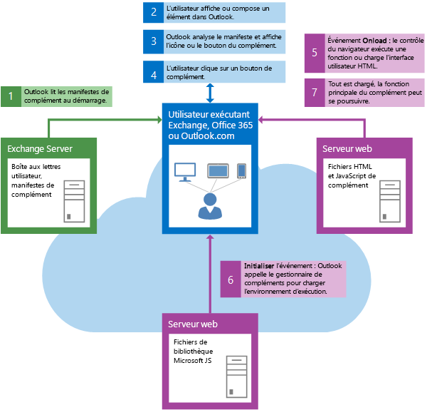

# Vue d’ensemble de l’architecture et des fonctionnalités des compléments Outlook

Un complément Outlook se compose d’un manifeste XML et d’un code (JavaScript et HTML). Ce manifeste spécifie le nom et la description du complément, ainsi que la manière dont il s’intègre dans Outlook. Le manifeste permet aux développeurs de placer des boutons sur des surfaces de commande, désactiver les correspondances d’expressions régulières, etc. Le manifeste définit également l’URL qui héberge le code JavaScript et HTML du complément.

Lorsqu’un utilisateur ou un administrateur acquiert un complément, le manifeste de ce dernier est enregistré dans la boîte aux lettres de l’utilisateur ou dans l’organisation. Lorsqu’Outlook démarre, il charge tous les manifestes que l’utilisateur a installé, les traite et configure tous les points d’extension du complément (par exemple, afficher les boutons dans des surfaces de commande, exécuter une expression régulière sur le message sélectionné, etc.). L’utilisateur peut ensuite utiliser le complément.

Lorsque l’utilisateur interagit avec le complément, les fichiers HTML et JavaScript sont chargés à partir de l’emplacement de l’hôte spécifié dans le manifeste.

Les compléments utilisent l’API Office.js pour accéder à l’API du complément Outlook et pour interagir avec Outlook.

**Interaction des composants les plus courants lorsque l’utilisateur démarre Outlook**

### Gestion des versions

Lorsque nous faisons évoluer les clients Outlook et la plateforme des compléments, et que nous ajoutons de nouveaux moyens d’intégration pour ces derniers, il est parfois impossible d’implémenter une fonctionnalité simultanément sur tous les clients (Mac, Windows, web, mobile). Pour gérer cette situation, nous contrôlons la version du manifeste et des API. Ainsi, la plateforme est toujours compatible avec les versions précédentes, ce qui signifie que les développeurs peuvent créer un complément qui fonctionne en version de bas niveau pour les clients plus anciens, mais également tirer parti des nouvelles fonctionnalités pour les clients plus récents. Pour en savoir plus sur le fonctionnement du contrôle de version, voir [Manifestes des compléments Outlook](manifests/manifests.md).

## Fonctionnalités des compléments Outlook

Les compléments Outlook offrent de nombreuses fonctionnalités enrichies qui peuvent être utilisées pour prendre en charge différents scénarios.

|**Fonctionnalité**|**Description**|
|:-----|:-----|
|Activation contextuelle|Les compléments contextuels Outlook peuvent s’activer en fonction des critères suivants :<ul><li>(par défaut) pour n’importe quel élément dans le calendrier ou la boîte aux lettres</li><li>pour un type d’élément spécifique (un message électronique, un message de demande de réunion ou un rendez-vous)</li><li>pour une classe de message d’élément</li><li>pour des entités spécifiques dans un message ou un rendez-vous, voir l’article sur les [compléments Outlook contextuels](contextual-outlook-add-ins.md)</li><li>en fonction de règles spécifiques ou d’expressions régulières, voir les articles sur les [règles d’activation pour les compléments Outlook](manifests/activation-rules.md) et l’[utilisation des règles d’activation d’expression régulière pour afficher un complément Outlook](use-regular-expressions-to-show-an-outlook-add-in.md)</li><li>pour les correspondances de chaîne de propriétés, voir l’article sur la [mise en correspondance des chaînes dans un élément Outlook en tant qu’entités connues](match-strings-in-an-item-as-well-known-entities.md)</li></ul>|
|Extensions de module|Une extension de module Outlook intègre votre complément dans la barre de navigation Outlook. Consultez cette page pour savoir comment [intégrer votre complément Outlook dans la barre de navigation Outlook](../outlook/extension-module-outlook-add-ins.md). Les extensions de module sont uniquement disponibles dans Outlook 2016 pour Windows.|
|Commandes de compléments|Les commandes de compléments Outlook permettent d’exécuter des actions de compléments spécifiques à partir du ruban. Elles sont uniquement disponibles pour les extensions de module et les compléments qui s’appliquent à tous les messages électroniques ou événements. Pour plus d’informations, voir [Commandes de complément pour Outlook](../outlook/add-in-commands-for-outlook.md). |
|Paramètres d’itinérance|Un complément Outlook peut enregistrer des données qui sont propres à la boîte aux lettres de l’utilisateur pour un accès dans une session Outlook ultérieure. Pour plus d’informations, voir [Obtenir et définir des métadonnées pour un complément Outlook](../outlook/metadata-for-an-outlook-add-in.md). |
|Propriétés personnalisées|Un complément Outlook peut enregistrer des données propres à un élément dans la boîte aux lettres de l’utilisateur pour un accès dans une session Outlook ultérieure. Pour plus d’informations, voir [Obtenir et définir des métadonnées pour un complément Outlook](../outlook/metadata-for-an-outlook-add-in.md).|
|Obtention des pièces jointes ou de la totalité de l’élément sélectionné|Un complément contextuel Outlook peut accéder à des pièces jointes et à la totalité de l’élément sélectionné à partir du serveur. Consultez les rubriques suivantes :<ul><li>Pièces jointes - voir les articles sur l’[obtention de pièces jointes d’un élément Outlook à partir du serveur](get-attachments-of-an-outlook-item.md) et sur [l’ajout de pièces jointes à un élément et leur suppression dans un formulaire de composition dans Outlook]add-and-remove-attachments-to-an-item-in-a-compose-form.md)</li><li>Totalité de l’élément sélectionné - cela est semblable à l’utilisation d’un jeton de rappel pour obtenir des pièces jointes. Consultez les rubriques suivantes :<ul><li>Méthode **mailbox.getCallbackTokenAsync** dans [Office.context.mailbox](../../reference/outlook/Office.context.mailbox.md) - Fournit un jeton de rappel pour identifier le code côté serveur du complément pour le serveur Exchange.</li><li>Propriété **item.itemId** dans [Office.context.mailbox](../../reference/outlook/Office.context.mailbox.item.md) - Identifie l’élément que l’utilisateur est en train de lire et qui est en cours d’obtention par le code côté serveur.</li><li>Propriété **mailbox.ewsUrl** dans [Office.context.mailbox](../../reference/outlook/Office.context.mailbox.md) - Fournit l’URL du point de terminaison EWS, ainsi que le jeton de rappel et l’ID d’élément, pouvant être utilisés par le code côté serveur pour accéder à l’opération EWS [GetItem](http://msdn.microsoft.com/en-us/library/e3590b8b-c2a7-4dad-a014-6360197b68e4(Office.15).aspx) afin d’obtenir l’élément dans son intégralité.</li></ul></li></ul>|
|Profil utilisateur|Un complément de messagerie peut accéder au nom d’affichage, à l’adresse électronique et au fuseau horaire dans le profil de l’utilisateur. Pour plus d’informations, voir l’objet [UserProfile](../../reference/outlook/Office.context.mailbox.userProfile.md).|

## Commencer à créer des compléments Outlook

Pour commencer à créer des compléments Outlook, voir [Prise en main des compléments Outlook pour Office 365](https://dev.outlook.com/MailAppsGettingStarted/GetStarted) ou [Intégrer votre complément Outlook dans la barre de navigation Outlook](../outlook/extension-module-outlook-add-ins.md).

## Ressources supplémentaires

Pour les concepts applicables au développement des compléments Office en général, voir :

- [Instructions de conception pour les compléments Office](../../docs/design/add-in-design.md)

- [Meilleures pratiques en matière de développement de compléments Office](../../docs/design/add-in-development-best-practices.md)

- [Gérer les licences de compléments pour Office et SharePoint](http://msdn.microsoft.com/library/3e0e8ff6-66d6-44ff-b0c2-59108ebd9181%28Office.15%29.aspx)

- [Soumission des compléments SharePoint et Office, ainsi que des applications web Office 365 dans l’Office Store](http://msdn.microsoft.com/library/ff075782-1303-4517-91cc-b3d730e9b9ae%28Office.15%29.aspx)

- [Interface API JavaScript pour Office](../../reference/javascript-api-for-office.md)

- [Manifestes des compléments Outlook](../outlook/manifests/manifests.md)

