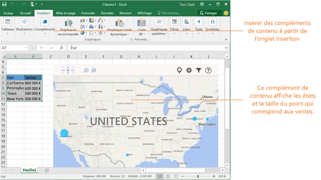
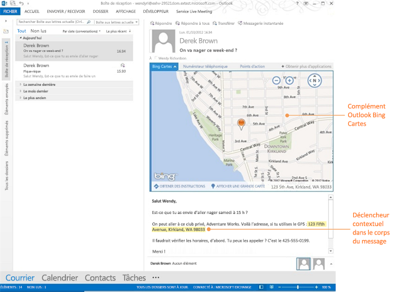
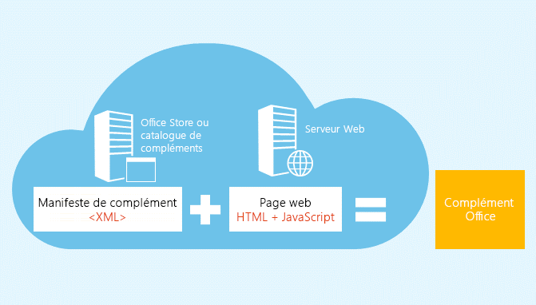

# Vue d’ensemble de la plateforme des compléments pour Office

Les compléments Office vous permettent d’étendre les clients Office tels que Word, Excel, PowerPoint et Outlook à l’aide des technologies web, telles que HTML, CSS et JavaScript. 

Vous pouvez utiliser des compléments Office pour effectuer les actions suivantes : 

-  **Ajouter de nouvelles fonctionnalités aux clients Office** : par exemple, vous pouvez améliorer Word, Excel, PowerPoint et Outlook en interagissant avec les documents et les éléments de courrier Office, en important des données dans Office, en traitant des documents Office, en exposant des fonctionnalités tierces dans les clients Office, et bien plus encore. 
    
-  **Créer de nouveaux objets interactifs et enrichis qui peuvent être incorporés dans des documents Office** : par exemple, des cartes, des graphiques et des visualisations interactives que les utilisateurs peuvent ajouter à leurs feuilles de calcul Excel et présentations PowerPoint.
    
**Les compléments Office peuvent être exécutés dans différentes versions d’Office**, notamment Office pour Windows pour ordinateur de bureau, Office Online, Office pour Mac et Office pour iPad.

>**Remarque :** Lorsque vous créez votre complément, si vous envisagez de le [publier](../publish/publish.md) dans Office Store, assurez-vous que vous respectez les [stratégies de validation Office Store](https://msdn.microsoft.com/en-us/library/jj220035.aspx). Par exemple, pour réussir la validation, votre complément doit fonctionner sur toutes les plateformes qui prennent en charge les méthodes définies (pour en savoir plus, consultez la [section 4.12](https://msdn.microsoft.com/en-us/library/jj220035.aspx#Anchor_3) et la [page relative à la disponibilité des compléments Office sur les plateformes et les hôtes](https://dev.office.com/add-in-availability)).

Pour savoir de manière détaillée quelle version d’Office prend en charge les compléments Office, consultez la page relative à la [disponibilité des compléments Office sur les plateformes et les hôtes](http://dev.office.com/add-in-availability). 

## Que peut faire un complément Office ?

Un complément Office peut pratiquement faire tout ce qu’une page web peut effectuer dans le navigateur, notamment :

- Étendre l’interface utilisateur native Office en créant des onglets et des boutons de ruban personnalisés.

- Fournir une interface interactive et une logique personnalisée avec HTML et JavaScript.
    
- Utiliser des infrastructures JavaScript comme jQuery, Angular, entre autres.
    
- Se connecter à des points d’extrémité et des services web REST par le biais de HTTP et d’AJAX.
    
- Exécuter du code ou une logique côté serveur, si la page est implémentée à l’aide d’un langage de script côté serveur tel qu’ASP ou PHP.
    

De plus, les compléments Office peuvent interagir avec l’application Office et le contenu de l’utilisateur d’un complément grâce à une [API JavaScript](../../docs/develop/understanding-the-javascript-api-for-office.md) fournie par l’infrastructure de compléments Office. 

## Types de compléments Office

Vous pouvez créer les types de compléments Office suivants :
 
- Compléments d’extension des fonctionnalités pour Word, Excel et PowerPoint
- Compléments de création d’objets pour Excel et PowerPoint
- Compléments d’extension des fonctionnalités pour Outlook

### Compléments d’extension des fonctionnalités pour Word, Excel et PowerPoint 
Vous pouvez **ajouter de nouvelles fonctionnalités** dans Word, Excel ou PowerPoint en enregistrant votre complément à l’aide d’un [manifeste de complément du volet Office](../design/add-in-commands.md). Ce manifeste prend en charge **deux modes d’intégration** :

- Commandes de compléments
- Volets Office à insérer

####Commandes de compléments
Utilisez les commandes de complément pour étendre l’interface utilisateur d’Office pour Windows pour ordinateur de bureau et Office Online. Par exemple, vous pouvez ajouter des **boutons sur le ruban** ou des menus contextuels spécifiques, pour permettre aux utilisateurs d’accéder facilement à leurs compléments Office. Les boutons de commande peuvent lancer différentes actions, par exemple **afficher un volet (ou plusieurs volets) avec un contenu HTML personnalisé** ou **exécuter une fonction JavaScript**. Nous vous conseillons de [regarder cette vidéo de Channel9](https://channel9.msdn.com/events/Build/2016/P551) pour avoir un aperçu complet de cette fonctionnalité.

**Complément incluant des commandes en cours d’exécution dans Excel (version Bureau)**

**Complément incluant des commandes en cours d’exécution dans Excel (version Online)**

Vous pouvez définir vos commandes dans votre manifeste de complément à l’aide de l’élément **VersionOverrides**. La plateforme Office se charge de les interpréter dans l’interface utilisateur native. Pour commencer, consultez ces [exemples sur GitHub](https://github.com/OfficeDev/Office-Add-in-Commands-Samples/), et lisez la page relative aux [commandes de complément pour Excel, Word et PowerPoint](../design/add-in-commands.md)

####Volets Office à insérer
Les clients ne prenant pas en charge les commandes de complément (Office 2013, Office pour Mac et Office pour iPad) exécuteront votre complément comme un **volet Office** à l’aide de l’élément **DefaultUrl** fourni dans le manifeste. Le complément peut ensuite être lancé via le menu **Mes compléments** depuis l’onglet Insertion. 

>**Important :** Un seul manifeste peut contenir un complément du volet Office qui s’exécute dans les clients ne prenant pas en charge les commandes, et une version qui s’exécute avec les commandes. Ainsi, vous bénéficiez d’un seul complément qui fonctionne avec tous les clients prenant en charge les compléments Office.
 
###Compléments de création d’objets pour Excel et PowerPoint 

Utilisez un manifeste de complément de contenu pour intégrer des **objets web pouvant être incorporés dans les documents**. Les compléments de contenu vous permettent d’intégrer des visualisations de données web enrichies, du contenu multimédia incorporé (comme un lecteur vidéo YouTube ou une galerie d’images) et d’autres types de contenu externe.

**Complément de contenu**

Pour tester un complément de contenu dans Excel 2013 ou Excel Online, installez le complément [Bing Cartes](https://store.office.com/bing-maps-WA102957661.aspx?assetid=WA102957661).

### Compléments d’extension des fonctionnalités pour Outlook

Les compléments Outlook peuvent développer le ruban Office et s’afficher en regard d’un élément Outlook quand vous le visualisez ou le composez. Ils fonctionnent avec un message électronique, une demande de réunion, une réponse à une demande de réunion, une annulation de réunion ou un rendez-vous dans un scénario de lecture (quand l’utilisateur visualise un élément reçu) ou dans un scénario de composition (quand l’utilisateur répond à un élément ou en crée un). 

Les compléments Outlook peuvent accéder aux informations contextuelles de l’élément, comme l’adresse ou l’ID de suivi, puis utiliser ces données pour accéder à des informations complémentaires sur le serveur et à partir des services web pour enrichir l’expérience utilisateur. Dans la plupart des cas, un complément Outlook s’exécute sans modification sur les différentes applications hôtes, notamment Outlook, Outlook pour Mac, Outlook Web App et OWA pour les périphériques, afin d’offrir aux utilisateurs une expérience transparente sur le bureau, le web, la tablette et les appareils mobiles.

Pour plus d’informations, consultez la page relative aux [compléments Outlook](../outlook/outlook-add-ins.md).

 >**Remarque**  Les compléments Outlook nécessitent la version de base d’Exchange 2013 ou d’Exchange Online pour héberger la boîte aux lettres de l’utilisateur. Les comptes de messagerie POP et IMAP ne sont pas pris en charge.

**Complément Outlook avec les boutons de commande dans le ruban**

**Complément Outlook contextuel**

Pour tester un complément Outlook dans Outlook, Outlook pour Mac ou Outlook Web App, installez le complément [Package Tracker](https://store.office.com/package-tracker-WA104162083.aspx?assetid=WA104162083).

## Structure d’un complément Office

Un complément Office de base se compose d’un fichier manifeste XML et de votre propre application web. Le manifeste définit différents paramètres, y compris la façon dont votre complément s’intègre avec les clients Office. Votre application web doit être hébergée sur un serveur web ou un service d’hébergement web, tel que [Microsoft Azure](../publish/host-an-office-add-in-on-microsoft-azure.md).

**Manifeste + page web = un complément pour Office**

###Manifeste

Le manifeste spécifie les paramètres et les possibilités du complément, notamment :
    
- Le nom d’affichage, la description, l’ID, la version et les paramètres régionaux par défaut du complément.
    
- Intégration du complément avec Office :     
      - Pour les compléments qui étendent Word/Excel/PowerPoint/Outlook : les points d’extension native que le complément utilise pour exposer les fonctionnalités, tels que les boutons du ruban.     
      - Pour les compléments qui créent des objets pouvant être intégrés : l’URL de la page par défaut qui est chargée pour l’objet.
       
    
- Le niveau d’autorisation et les conditions d’accès aux données pour le complément.
    
Pour plus d’informations, voir le [manifeste XML de compléments Office](../../docs/overview/add-in-manifests.md).

###Application web

La version de base d’une application web compatible est une page web HTML statique. La page peut être hébergée sur un serveur web ou un service d’hébergement web, tel que [Microsoft Azure](../publish/host-an-office-add-in-on-microsoft-azure.md). Vous pouvez héberger votre application web sur le service de votre choix.  

Le complément Office le plus simple est composé d’une page HTML statique qui est affichée dans une application Office, mais qui n’interagit pas avec le document Office ou une autre ressource Internet. Cependant, puisqu’il s’agit d’une application web, vous pouvez utiliser n’importe quelle technologie, côté client et serveur, prise en charge par votre fournisseur d’hébergement (par exemple, ASP.net, PHP ou Node.js). Pour interagir avec les clients et les documents Office, vous pouvez utiliser l’[API JavaScript](../../docs/develop/understanding-the-javascript-api-for-office.md) office.js que nous proposons. 

**Composants d’un complément Office Hello World**

### Interfaces API JavaScript

Les API JavaScript pour Word et Excel fournissent des modèles d’objet propres à chaque hôte que vous pouvez utiliser dans un complément Office. Ces API permettent d’accéder à des objets connus tels que des paragraphes et des classeurs, ce qui vous permet de créer plus facilement un complément pour Word ou Excel. Pour en savoir plus sur ces API, consultez les articles sur les [compléments Word](../word/word-add-ins-programming-overview.md) et les [compléments Excel](../excel/excel-add-ins-javascript-programming-overview.md).

L’API JavaScript pour Office est composée d’objets et de membres pour créer des compléments et interagir avec le contenu Office et les services web.

Pour plus d’informations sur l’interface API JavaScript pour Office, consultez les articles [Présentation de l’API JavaScript pour Office](../../docs/develop/understanding-the-javascript-api-for-office.md) et [Interface API JavaScript pour Office](../../reference/javascript-api-for-office.md).
    
## Ressources supplémentaires

- [Instructions de conception pour les compléments Office](../../docs/design/add-in-design.md)
    
- [Référence d’API](../../docs/develop/understanding-the-javascript-api-for-office.md)
    
