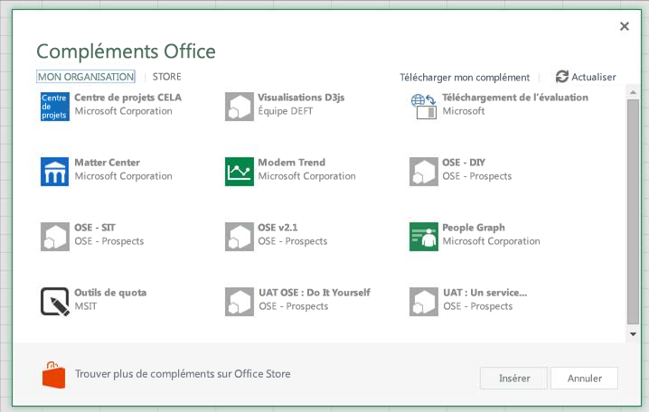
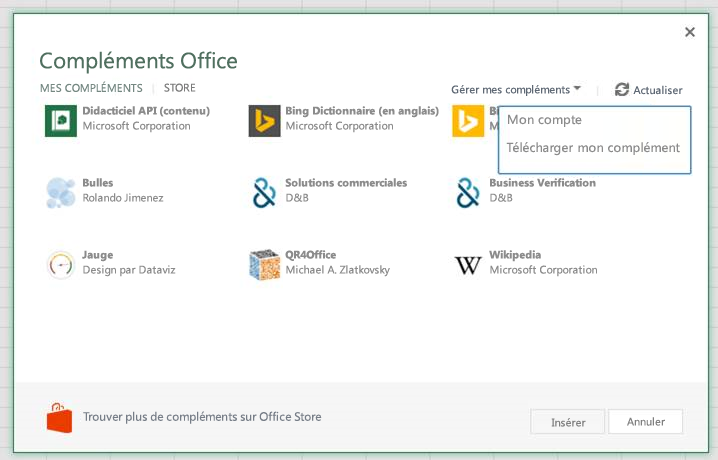

# Chargement de version test des compléments Office dans Office Online

Vous pouvez installer un complément Office test sans avoir à le placer au préalable dans un catalogue de compléments en utilisant le chargement de version test. Le chargement de version test peut être effectué sur Office 365 ou Office Online. La procédure présente de légères différences d’une plateforme à l’autre. 

Lorsque vous chargez une version test d’un complément, le manifeste du complément est stocké dans le stockage local du navigateur. Ainsi, si vous videz le cache du navigateur ou si vous basculez vers un autre navigateur, vous devez à nouveau charger une version test de complément.

 >**Remarque**  Sideloading as described in this article is supported on Word, Excel, and PowerPoint. To sideload an Outlook add-in, see [Chargement de version test des compléments Outlook](sideload-outlook-add-ins-for-testing.md).

## Sideload an Complément Office on Office 365

1. Connectez-vous à votre compte Office 365.
    
2. Ouvrez le lanceur d’applications à l’extrémité gauche de la barre d’outils et sélectionnez  **Excel**,  **Word** ou  **PowerPoint**, puis créez un document.
    
3. Ouvrez l’onglet **Insérer** dans le ruban, puis dans la section **Compléments**, choisissez **Compléments Office**.
    
4. Dans la boîte de dialogue **Compléments Office**, sélectionnez l’onglet **MON ORGANISATION**, puis **Télécharger mon complément**.
    
    

5.  **Accédez** au fichier manifeste du complément, puis sélectionnez **Télécharger**.
    
    

6. Verify that your complément is installed. For example, if it is an add-in command, it should appear on either the ribbon or the context menu. If it is a task pane add-in the pane should appear.
    

## Charger une version test d’un complément Office sur Office Online

1. Open [Microsoft Office Online](https://office.live.com/).
    
2. Dans **Commencer à utiliser les applications en ligne maintenant**, choisissez **Excel**, **Word** ou **PowerPoint**, puis ouvrez un document.
    
3. Ouvrez l’onglet **Insérer** dans le ruban, puis dans la section **Compléments**, choisissez **Compléments Office**.
    
4. Dans la boîte de dialogue **Compléments Office**, sélectionnez l’onglet **MES COMPLÉMENTS**, choisissez **Gérer mes compléments**, puis **Télécharger mon complément**.
    
    

5.  **Accédez** au fichier manifeste du complément, puis sélectionnez **Télécharger**.
    
    

6. Vérifiez que votre complément est installé. S’il s’agit d’une commande de complément, elle doit apparaître dans le ruban ou dans le menu contextuel. S’il s’agit d’un complément du volet Office, le volet doit apparaître.
    
