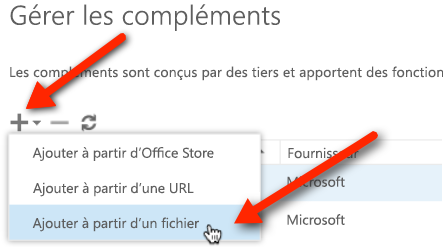

# Chargement de version test des compléments Outlook

Vous pouvez utiliser le chargement de version test pour installer un complément Outlook sans avoir à le placer au préalable dans un catalogue de compléments.

 >**Remarque**  Vous pouvez également charger une version test des compléments pour d’autres applications de la suite Office. Pour plus d’informations, voir [Chargement de version test des compléments Office](create-a-network-shared-folder-catalog-for-task-pane-and-content-add-ins.md).

## Chargement de version test des compléments Outlook

1. Accédez à [Outlook Web App](https://outlook.office365.com).
    
2. Cliquez sur l’icône d’engrenage en haut à droite et sélectionnez  **Gérer des compléments**.
    
    

3. Sur la page  **Gérer des compléments**, cliquez sur l’icône  **+**, puis sélectionnez  **Ajouter à partir d’un fichier**.
    
    

4. Localisez le fichier manifeste de votre complément personnalisé et installez-le. Acceptez toutes les invites pendant l’installation.
    
Une fois cette opération terminée, sélectionnez un courrier électronique existant. Une barre horizontale s’affiche alors en dessous de l’en-tête du courrier électronique qui inclut le complément. Ensuite, créez un courrier électronique, puis cliquez sur l’option de menu  **Compléments** (ou **Applications**) pour afficher le volet Office. Sélectionnez le complément. Celui-ci s’affiche dans le volet Office.

    
