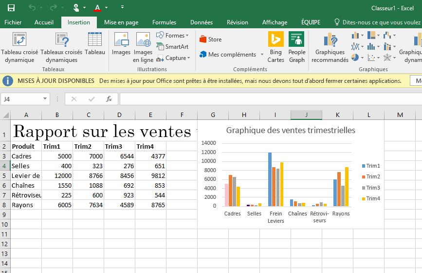
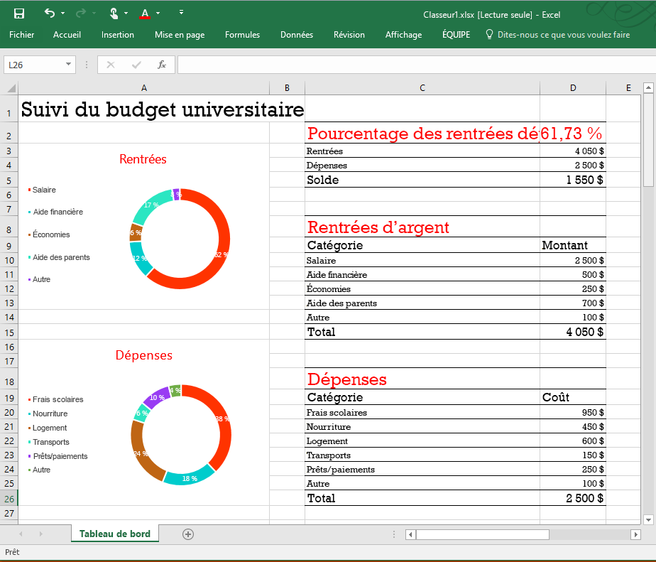
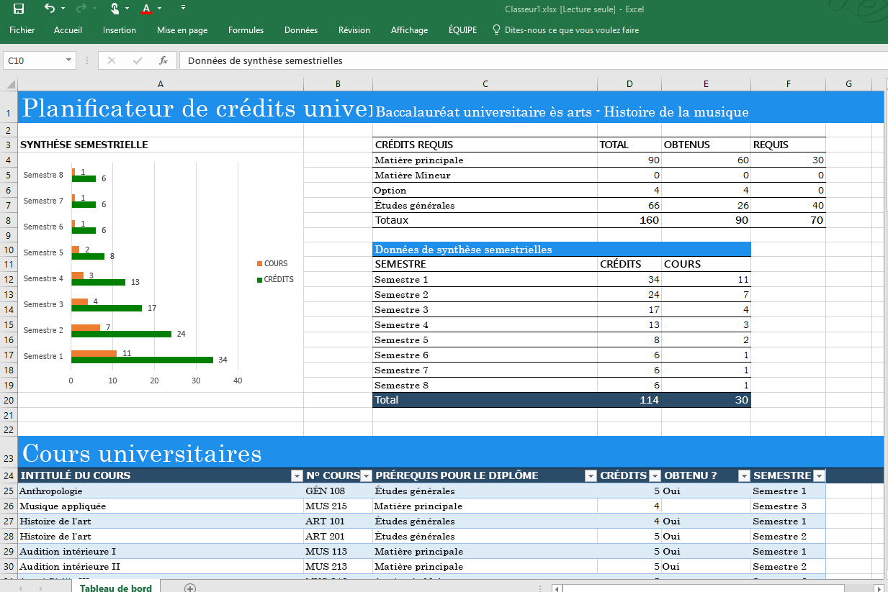
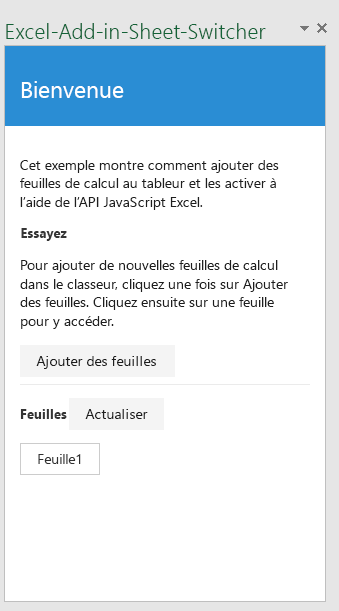
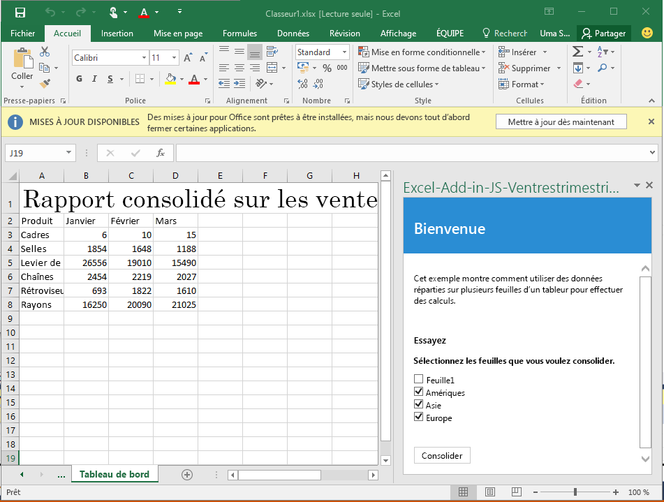
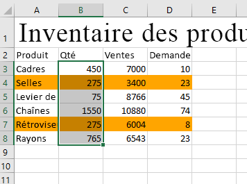

# Exemples de code pour les compléments Excel

_S’applique à : Excel 2016, Office 2016_

Vous trouverez ci-dessous des exemples de code qui utilisent l’API JavaScript dans Excel 2016, pour les consulter rapidement. 

**[Exemple de rapport sur les ventes trimestrielles](https://github.com/OfficeDev/Excel-Add-in-JS-QuarterlySalesReport)** : simple complément de volet de tâches permettant de charger des données dans une feuille de calcul et de créer un graphique de base dans Excel 2016. 

**[Exemple d’outil de suivi de budget universitaire](https://github.com/OfficeDev/Excel-Add-in-JS-CollegeBudgetTracker)** : complément de volet de tâches qui montre comment créer un outil de suivi du budget universitaire à l’aide des API JavaScript dans Excel 2016. 

**[Exemple d’outil de suivi des crédits universitaires](https://github.com/OfficeDev/Excel-Add-in-JS-CollegeCreditsTracker)** : complément de volet de tâches qui montre comment créer un outil de suivi des crédits universitaires à l’aide des API JavaScript dans Excel 2016. 

**[Exemple de sélecteur de feuilles](https://github.com/OfficeDev/Excel-Add-in-JS-SheetSwitcher)** : complément de volet de tâches permettant d’ajouter de nouvelles feuilles de calcul à un classeur et d’y accéder dans Excel 2016. 

**[Exemple de rapport consolidé sur les ventes](https://github.com/OfficeDev/Excel-Add-in-JS-ConsolidatedSalesReport)** : complément de volet de tâches qui montre comment consolider les données de plusieurs feuilles de calcul à l’aide des API JavaScript dans Excel 2016. 

**[Exemple d’outil de mise en évidence de plages](https://github.com/OfficeDev/Excel-Add-in-JS-RangeHighlighter)** : complément de volet de tâches qui montre comment effectuer des opérations courantes à l’aide de l’API Range dans Excel 2016.

Vous pouvez utiliser l’[explorateur d’extraits de code JavaScript d’Office 2016](http://officesnippetexplorer.azurewebsites.net/#/snippets/excel) pour parcourir des exemples de code conçus pour des cas de figure courants et pour savoir comment fonctionnent les nouvelles API. 

### Ressources supplémentaires

Les API JavaScript pour Excel peuvent vous offrir beaucoup pour l’élaboration de vos compléments. Voici quelques-unes des ressources disponibles : 

*  [Création de votre premier complément Excel](build-your-first-excel-add-in.md)
*  [Présentation de la programmation JavaScript pour les compléments Excel](excel-add-ins-programming-overview.md)
*  [Référence de l’API JavaScript pour les compléments Excel](excel-add-ins-javascript-reference.md)
